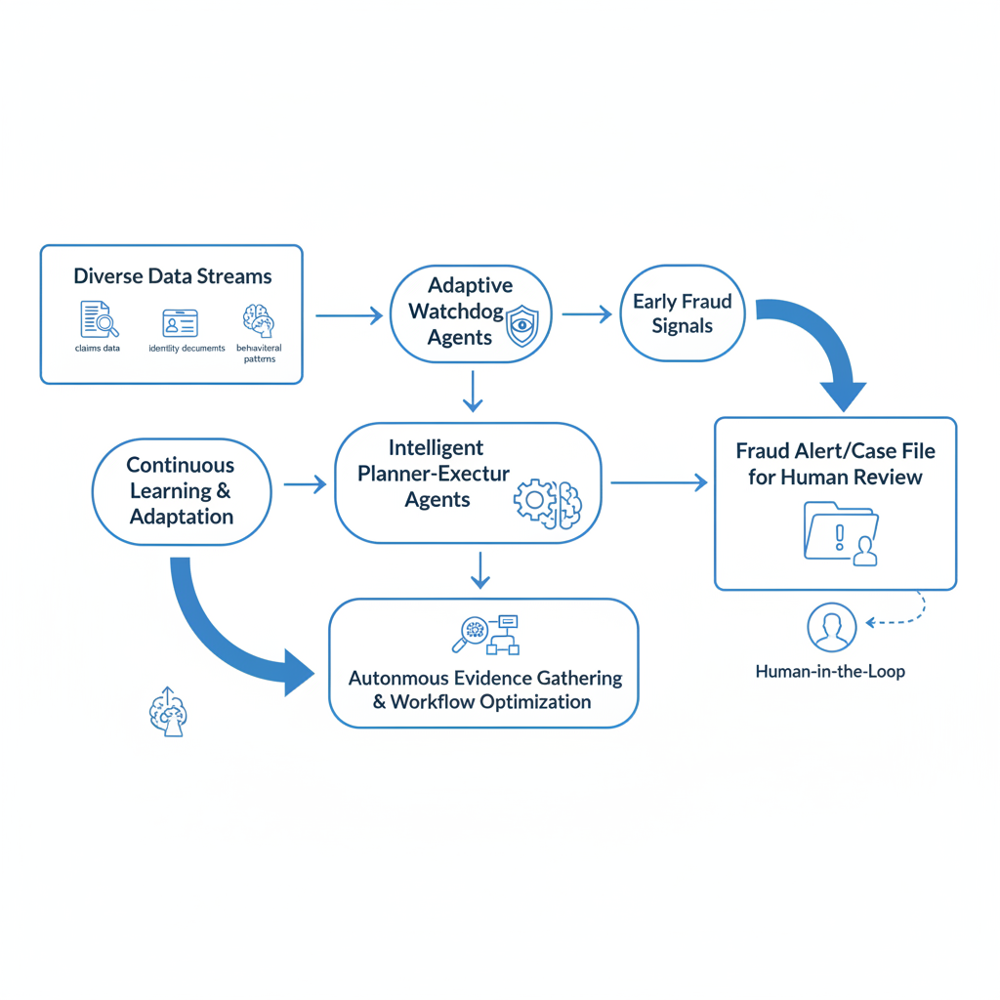
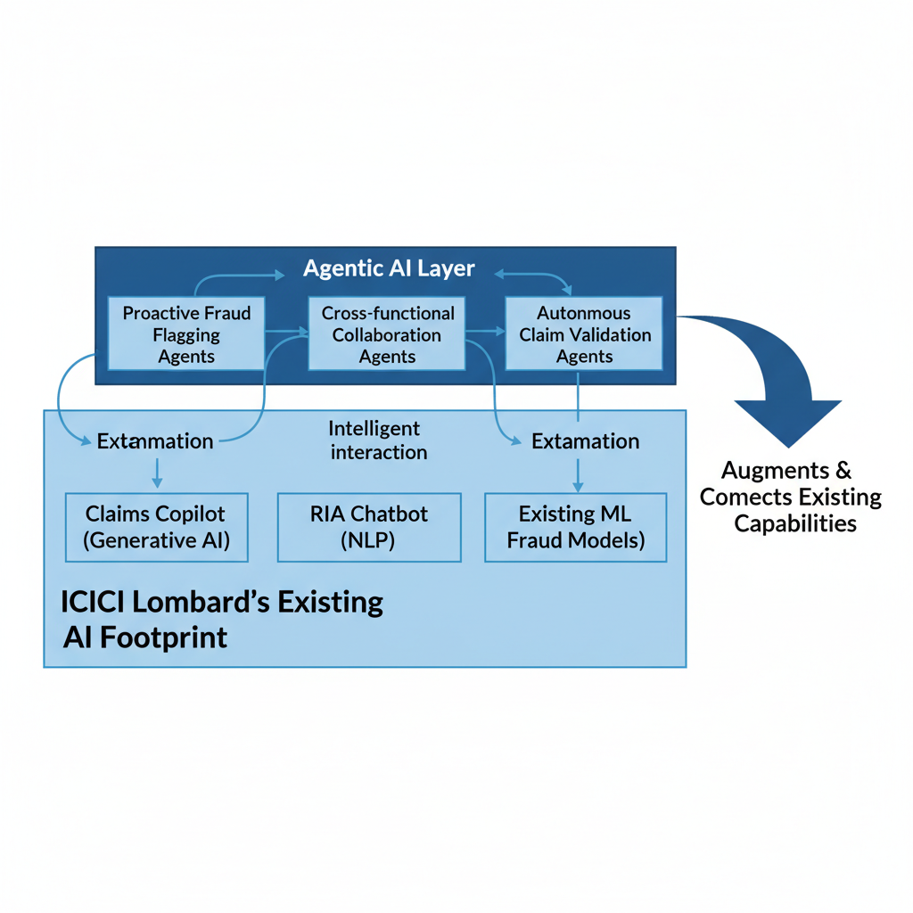

# Integrating Agentic AI for Advanced Fraud Detection in the ICICI Lombard Ecosystem

## Introduction to Agentic AI and its Transformative Potential in Insurance

Agentic AI represents a significant evolution beyond traditional reactive AI or even generative AI, introducing a paradigm of truly autonomous systems. Unlike predecessors that respond to prompts or execute predefined tasks, Agentic AI systems are designed to plan, act, and adapt independently to achieve specific goals [Source](https://www.hyland.com/en/resources/articles/agentic-ai-in-insurance).

The core capabilities of Agentic AI lie in its goal-oriented behavior, sophisticated decision-making, and continuous learning from interactions and outcomes [Source](https://www.hyland.com/en/resources/articles/agentic-ai-in-insurance) [Source](https://www.dig-in.com/news/agentic-ai-poised-for-growth-in-2026). These systems can perceive their environment, formulate strategies, execute complex tasks, and refine their approach over time without constant human intervention [Source](https://www.cognizant.com/us/en/insights/insights-blog/agentic-ai-in-life-insurance).

This transformative potential extends across the entire insurance value chain. From enhancing the precision of underwriting and streamlining claims processing to bolstering fraud detection and optimizing risk management, Agentic AI promises to revolutionize operational efficiency and customer experience [Source](https://www.hyland.com/en/resources/articles/agentic-ai-in-insurance) [Source](https://www.flowable.com/blog/business/ai-agent-use-cases-insurance).

Industry projections underscore this shift, with a significant percentage of insurers globally expected to deploy Agentic AI solutions by 2026, signaling a rapid embrace of these advanced capabilities [Source](https://www.dig-in.com/news/agentic-ai-poised-for-growth-in-2026).

## The Mounting Challenge of Insurance Fraud and Current Detection Limitations

Insurance fraud represents a pervasive and costly burden, resulting in billions of dollars in annual losses globally and impacting insurer profitability and policyholder premiums [Source](https://www.hyland.com/en/resources/articles/agentic-ai-in-insurance) [Source](https://masterofcode.com/blog/agentic-ai-in-insurance). This challenge is particularly pronounced in rapidly growing markets like India, where fraud schemes are becoming increasingly sophisticated. They often involve subtle patterns, complex collusion, and identity manipulation, moving beyond simple, isolated incidents to intricate plots [Source](https://www.hyland.com/en/resources/articles/agentic-ai-in-insurance). These advanced tactics exploit loopholes and mimic legitimate claims, making them difficult to identify.

Traditional fraud detection methods, primarily static rule-based systems and basic machine learning models, struggle to keep pace with these evolving threats [Source](https://www.hyland.com/en/resources/articles/agentic-ai-in-insurance) [Source](https://masterofcode.com/blog/agentic-ai-in-insurance). Inherently reactive, these legacy systems are designed to catch known fraud patterns, failing to proactively identify novel or adaptive schemes [Source](https://www.flowable.com/blog/business/ai-agent-use-cases-insurance). Their inability to discern nuanced relationships results in high false positives and, crucially, missed genuine fraud.

Such limitations necessitate extensive, labor-intensive manual review processes, leading to significant delays in claims processing and increased investigative costs [Source](https://www.hyland.com/en/resources/articles/agentic-ai-in-insurance) [Source](https://masterofcode.com/blog/agentic-ai-in-insurance). This operational burden fosters a reactive posture, allowing fraudsters to operate undetected for longer. Insurers thus face not only direct financial losses but also strained customer trust and operational inefficiencies, underscoring an urgent need for more advanced, proactive detection capabilities.

## Agentic AI's Advanced Capabilities for Proactive Fraud Detection

Agentic AI marks a significant evolution in fraud detection, shifting from reactive analysis to proactive, adaptive, and intelligent strategies. At its core, this paradigm leverages autonomous agents to continuously monitor and respond to dynamic threats, fundamentally enhancing an insurer's ability to safeguard against financial losses.

Central to this approach are adaptive 'watchdog' agents that operate tirelessly, continuously monitoring diverse data streams [Source](https://www.flowable.com/blog/business/ai-agent-use-cases-insurance). These agents scrutinize everything from identity verification documents and past medical claims to real-time behavioral patterns and transaction histories. Their function is to identify early fraud signals, such as unusual claim patterns, inconsistencies in submitted information, or suspicious network activity, often long before a traditional system would flag them [Source](https://www.hyland.com/en/resources/articles/agentic-ai-in-insurance). This continuous vigilance allows for intervention at the nascent stages of potential fraud.

*Flowchart of an Agentic AI fraud detection system, showing continuous data monitoring, agent collaboration, proactive investigation, and a feedback loop for continuous learning.*
Moving beyond mere detection, intelligent planner-executor agents can autonomously sequence evidence requests, proactively retrieve missing documents, and optimize entire investigation workflows [Source](https://www.cognizant.com/us/en/insights/insights-blog/agentic-ai-in-life-insurance). For instance, if an initial claim triggers a low-severity alert, a planner agent might automatically request supplementary medical records from an authorized provider, cross-reference them with public databases, and then present a consolidated case file to a human investigator, significantly streamlining the process and reducing manual overhead [Source](https://www.skan.ai/blogs/top-7-agentic-ai-use-cases-for-pc-insurance-automation).

Agentic AI's true power lies in its ability to identify complex correlations and subtle patterns in real-time data that traditional, rule-based systems often miss [Source](https://www.dig-in.com/news/agentic-ai-poised-for-growth-in-2026). Fraudsters constantly evolve their tactics, and agentic systems, with their capacity for deep learning and contextual reasoning, can adapt to these new schemes. They can uncover hidden relationships between seemingly unrelated data points, revealing sophisticated fraud rings or emerging modus operandi that would otherwise remain undetected.

The culmination of these capabilities is autonomous decision-making and continuous learning, which are critical for improving accuracy and reducing financial losses [Source](https://masterofcode.com/blog/agentic-ai-in-insurance). As agents process more data and observe the outcomes of their interventions, they refine their algorithms and decision-making parameters. This iterative learning process ensures that the fraud detection system becomes progressively more intelligent and efficient, leading to fewer false positives, quicker resolution of legitimate claims, and a more robust defense against evolving fraud threats.

## ICICI Lombard's Existing AI Footprint: A Foundation for Agentic Integration

ICICI Lombard has consistently demonstrated a proactive approach to integrating advanced technologies, establishing a robust AI and Machine Learning (ML) footprint that serves as a strong foundation for future agentic AI deployments. This commitment is particularly evident in its efforts to enhance fraud detection and operational efficiencies across various insurance verticals.

The insurer currently leverages AI/ML extensively for fraud detection, notably within motor and health insurance segments. By deploying sophisticated algorithms, ICICI Lombard effectively identifies outliers and suspicious patterns in claims data, flagging potential fraudulent activities that might otherwise go unnoticed [Source](https://www.lifeinsuranceinternational.com/news/ai-insurance-icici-lombard/). This includes the use of AI to automate cashless hospital claims processing, improving both speed and accuracy while simultaneously bolstering fraud prevention mechanisms [Source](https://www.cio.com/article/218470/icici-lombard-gic-embeds-ai-for-cashless-hospital-claims.html), [Source](https://www.icicilombard.com/health-insurance/blogs/icici-lombard-first-to-launch-ai-automated-health-insurance-claims).

A prime example of their innovative approach is the 'Claims Copilot' solution. Developed in collaboration with Microsoft Azure and OpenAI, this generative AI-powered tool is designed to accelerate claims adjudication. By automating aspects of the claims process, the Claims Copilot significantly reduces turnaround times and plays a critical role in identifying and mitigating fraud, waste, and abuse, thereby enhancing overall claims efficiency and integrity [Source](https://www.linkedin.com/posts/icici-lombard_icici-lombard-increasing-productivity-using-activity-7287657735725215745-Diqy), [Source](https://www.microsoft.com/en-in/aifirstmovers/icici-lombard).

Furthermore, ICICI Lombard has enhanced its customer service capabilities through the implementation of RIA, an NLP-enabled generative AI chatbot. RIA serves as a critical touchpoint for policyholders, providing instant assistance with policy inquiries and claims-related questions, thereby improving customer satisfaction and streamlining service delivery [Source](https://www.bankinfosecurity.com/icici-lombards-ai-strategy-automates-customer-services-a-25256). These initiatives underscore ICICI Lombard's broader strategy of modernizing backend systems and leveraging AI to drive significant process efficiencies, setting the stage for the seamless integration of more autonomous agentic AI systems.

## Strategic Integration: Weaving Agentic AI into ICICI Lombard's Ecosystem

Integrating Agentic AI into ICICI Lombard's operational fabric demands a strategic, phased approach, building upon the insurer's robust existing AI infrastructure. ICICI Lombard has already demonstrated a commitment to leveraging AI for enhanced customer service and fraud detection [Source](https://www.lifeinsuranceinternational.com/news/ai-insurance-icici-lombard/) [Source](https://www.bankinfosecurity.com/icici-lombards-ai-strategy-automates-customer-services-a-25256/). The strategic path forward involves **leveraging these established data pipelines and AI models as foundational layers for agentic systems**. Rather than a rip-and-replace, agentic components can be incrementally introduced, utilizing the rich datasets and predictive capabilities already in place to inform and train autonomous agents [Source](https://onereach.ai/blog/best-practices-for-ai-agent-implementations/). This approach ensures continuity, maximizes past investments, and accelerates time-to-value for new agentic deployments.

*Diagram illustrating the strategic integration of Agentic AI components with ICICI Lombard's existing AI infrastructure, including Claims Copilot and customer service chatbots, for enhanced fraud detection and cross-functional collaboration.*
A prime area for immediate impact is the **Claims Copilot**. ICICI Lombard's existing Claims Copilot has proven instrumental in increasing productivity [Source](https://www.linkedin.com/posts/icici-lombard_icici-lombard-increasing-productivity-using-activity-7287657735725215745-Diqy). Agentic AI can significantly augment this tool by providing proactive fraud flagging and deeper contextual analysis during adjudication. For instance, an agent could autonomously cross-reference claim details against historical fraud patterns, external data sources, and even public records, identifying suspicious anomalies or complex networks of fraudulent activity that might elude human review or simpler rule-based systems [Source](https://www.hyland.com/en/resources/articles/agentic-ai-in-insurance) [Source](https://www.skan.ai/blogs/top-7-agentic-ai-use-cases-for-pc-insurance-automation). This proactive capability transforms the Copilot from a productivity enhancer to a powerful fraud deterrent.

Furthermore, agentic intelligence can **empower existing AI systems, such as ICICI Lombard's automated customer service and claims processing systems, to perform initial claim validation and identify potential fraud indicators at the point of intimation** [Source](https://www.bankinfosecurity.com/icici-lombards-ai-strategy-automates-customer-services-a-25256) [Source](https://www.icicilombard.com/health-insurance/blogs/icici-lombard-first-to-launch-ai-automated-health-insurance-claims). By autonomously analyzing incoming claim data—such as policy details, reported damages, and claimant history—agents can flag discrepancies or high-risk profiles immediately, even before human intervention. This early detection mechanism significantly reduces the cost and complexity of fraud investigation by stopping fraudulent claims closer to their origin [Source](https://www.flowable.com/blog/business/ai-agent-use-cases-insurance).

Beyond individual departmental enhancements, the true power of agentic AI lies in its potential for **cross-functional agent collaboration**. Imagine a scenario where agents specializing in underwriting, policy management, and claims autonomously share insights and coordinate actions. An underwriting agent might flag a policy applicant based on historical data indicating a higher fraud risk, which is then automatically communicated to a claims agent for heightened scrutiny if a claim is filed. Conversely, a claims agent identifying a new fraud pattern could inform the underwriting agent to adjust risk assessment parameters. This seamless, intelligent hand-off optimizes workflows across the entire insurance lifecycle, fostering a holistic and adaptive fraud defense system that continuously learns and evolves [Source](https://www.hyland.com/en/resources/articles/agentic-ai-in-insurance) [Source](https://www.flowable.com/blog/business/ai-agent-use-cases-insurance).

## Navigating Implementation Challenges and Ensuring Responsible AI in India

While the promise of Agentic AI in fraud detection is transformative, its successful integration, particularly within a dynamic market like India, necessitates a clear-eyed understanding of inherent implementation challenges. Organizations like ICICI Lombard, pioneering AI adoption, must anticipate and mitigate these complexities to truly unlock the technology's potential.

A primary concern revolves around the **regulatory and ethical considerations** inherent in autonomous decision-making. Agentic AI systems, by design, operate with a degree of autonomy, raising questions about transparency and accountability when making critical fraud detection decisions [Source](https://www.hyland.com/en/resources/articles/agentic-ai-in-insurance). Ensuring that these systems are explainable, auditable, and adhere to a robust ethical framework is paramount. Regulatory bodies are increasingly scrutinizing AI deployments, demanding clear lines of responsibility, especially in sensitive financial contexts. Robust AI governance frameworks are crucial for managing these risks, ensuring fairness, and preventing unintended biases [Source](https://www.teksystems.com/en-hk/insights/article/agentic-ai-governance).

Beyond ethics, significant **technical and operational hurdles** exist. Data governance complexities are amplified by Agentic AI's need for vast, high-quality, and diverse datasets to learn and adapt effectively. Integrating these advanced AI systems with existing legacy infrastructure, a common challenge in established financial institutions, can be arduous [Source](https://www.linkedin.com/pulse/5-most-critical-challenges-implementing-agentic-ai-anurag-srivastava-peofc) [Source](https://www.fluxforce.ai/blog/banking-agentic-ai-challenges). This necessitates a shift towards robust, enterprise-ready AI frameworks that can seamlessly integrate, scale, and provide the necessary computational backbone while maintaining data integrity and security [Source](https://onereach.ai/blog/best-practices-for-ai-agent-implementations/).

The **Indian context introduces specific challenges** that demand tailored strategies. While digital transformation is accelerating, equitable infrastructure access, particularly in semi-urban and rural areas, can still be a limiting factor [Source](https://www.linkedin.com/pulse/5-most-critical-challenges-implementing-agentic-ai-anurag-srivastava-peofc). Internet reliability and varying levels of cloud adoption across the financial sector can impact the real-time processing capabilities and scalability required by advanced Agentic AI systems [Source](https://www.linkedin.com/pulse/5-most-critical-challenges-implementing-agentic-ai-anurag-srivastava-peofc). Navigating these regional disparities is vital for nationwide deployment.

To effectively address these challenges, a multi-pronged **mitigation strategy** is essential. Companies should consider phased rollouts, beginning with controlled environments and expanding as confidence and capabilities grow [Source](https://onereach.ai/blog/best-practices-for-ai-agent-implementations/). Establishing strong governance frameworks that define oversight, audit trails, and human-in-the-loop interventions is non-negotiable [Source](https://www.teksystems.com/en-hk/insights/article/agentic-ai-governance). Implementing comprehensive data privacy protocols, in line with local regulations, will build trust and ensure compliance. Crucially, proactive collaboration with regulatory bodies is vital to shape future guidelines, ensuring that innovation can thrive responsibly within the evolving Indian financial landscape [Source](https://www.ey.com/en_in/insights/ai/agentic-ai-india). By embracing these strategies, organizations can pave a responsible and efficient path for Agentic AI integration.

## The Future of Fraud Detection: A Vision for ICICI Lombard with Agentic AI

The full integration of Agentic AI is set to redefine fraud detection at ICICI Lombard, ushering in an era of unparalleled efficiency and trust. By leveraging autonomous AI agents that proactively identify and mitigate suspicious patterns, ICICI Lombard can anticipate and prevent fraudulent activities with unprecedented accuracy. This enhanced capability is projected to lead to a significant reduction in financial losses from fraud, potentially unlocking substantial ROI [Source](https://masterofcode.com/blog/agentic-ai-in-insurance). The resulting improvement in profitability will directly translate into greater policyholder value, fostering a more sustainable and equitable insurance ecosystem for all.

Beyond financial gains, Agentic AI will drive a new era of operational efficiency. Manual efforts currently dedicated to investigation and verification will be drastically reduced, freeing up human talent for more complex, strategic tasks [Source](https://www.flowable.com/blog/business/ai-agent-use-cases-insurance). Proactive fraud prevention, facilitated by these intelligent agents, will accelerate the entire claims processing lifecycle. ICICI Lombard has already demonstrated success in increasing productivity using AI-powered claims copilots [Source](https://www.linkedin.com/posts/icici-lombard_icici-lombard-increasing-productivity-using-activity-7287657735725215745-Diqy), and Agentic AI represents the next leap in this journey towards hyper-efficient operations.

Superior fraud detection is not merely an internal efficiency gain; it is a powerful catalyst for building and maintaining customer trust. By effectively countering insurance fraud [Source](https://www.lifeinsuranceinternational.com/news/ai-insurance-icici-lombard/) and ensuring that only legitimate claims are honored, ICICI Lombard reinforces its commitment to fairness and reliability. This strengthens the bond with policyholders, assuring them that their premiums are being managed responsibly and that the insurer stands as a dependable partner in times of need.

Embracing Agentic AI positions ICICI Lombard at the forefront of AI-driven insurance innovation, not just within India but on a global scale. As Agentic AI is poised for significant growth in 2026 [Source](https://www.dig-in.com/news/agentic-ai-poised-for-growth-in-2026), ICICI Lombard's proactive adoption, building on its history of pioneering AI in health insurance claims [Source](https://www.icicilombard.com/health-insurance/blogs/icici-lombard-first-to-launch-ai-automated-health-insurance-claims), establishes a new benchmark for risk management and operational excellence. This strategic move solidifies its reputation as a forward-thinking leader, inspiring broader industry transformation.
