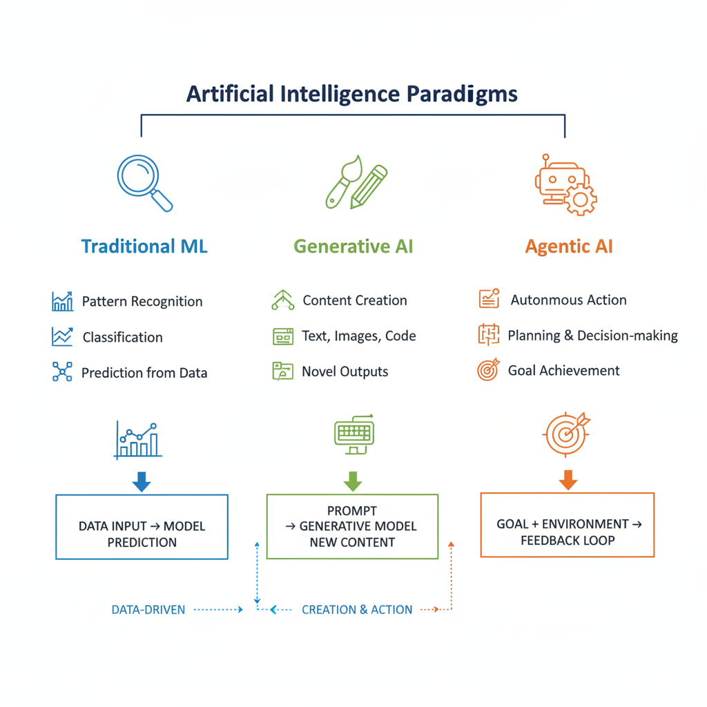
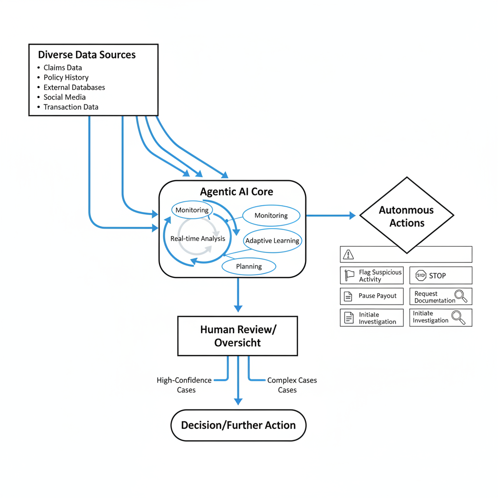
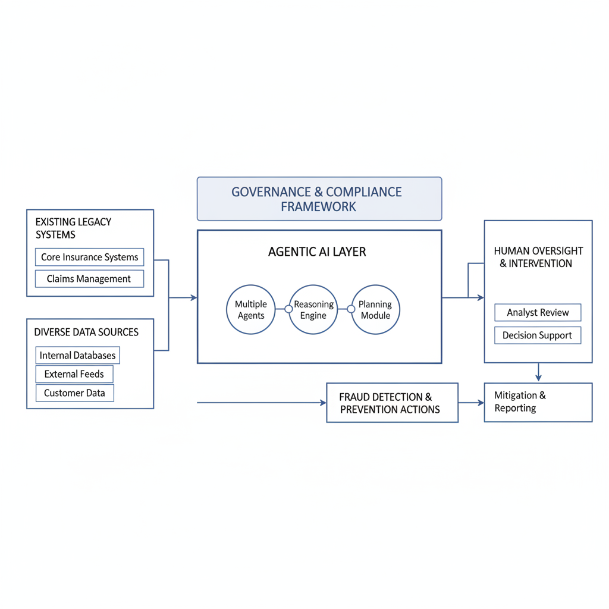

# Integrating Agentic AI for Next-Gen Fraud Detection at ICICI Lombard

## Introduction: The Evolving Landscape of Insurance Fraud

The fight against insurance fraud has historically involved identifying clear, often isolated incidents like staged accidents or inflated claims. However, the modern landscape presents a far more formidable challenge. We've moved beyond simple, traditional schemes to sophisticated, multi-layered operations involving organized crime, digital identity manipulation, and complex network-based conspiracies that leverage advanced data and technology.

In this escalating battle, conventional fraud detection methods are increasingly outmatched. Static rule-based systems, while foundational, are inherently rigid and easily bypassed by novel patterns, leading to high false positives and missed threats. Even early machine learning models, often trained on historical data, struggle to adapt to rapidly evolving adversarial tactics, failing to grasp the nuanced context or predict emergent fraud vectors. Their reactive nature means they often detect fraud after it has occurred, limiting proactive prevention.

This dynamic environment necessitates a paradigm shift in our defensive capabilities. Agentic AI, with its capacity for autonomous reasoning, adaptive learning, and proactive decision-making, emerges as a powerful and essential solution. It promises to move beyond mere detection to intelligent investigation and prevention, setting the stage for a new era of security in the insurance sector.

## What is Agentic AI and How Does It Differ?

Agentic AI represents a significant evolution in artificial intelligence, moving beyond static models to create truly autonomous software entities. At its core, Agentic AI involves intelligent agents designed to act independently, making decisions and executing tasks to achieve specific, predefined goals without constant human intervention. These agents operate with a degree of self-direction, observing their environment, forming plans, and taking actions to progress towards their objectives.

This autonomy sharply differentiates Agentic AI from other prominent AI paradigms. Unlike **generative AI**, which excels at creating new content—such as text, images, or code—based on learned patterns, Agentic AI's primary function is not creation but *action*. Similarly, it extends far beyond **traditional machine learning (ML)**, which primarily focuses on pattern recognition, classification, and prediction based on historical data. While traditional ML provides the intelligence (e.g., identifying a fraudulent transaction), Agentic AI takes that insight and *acts* upon it.

The true power of Agentic AI lies in its capability to chain multiple actions in sequence, enabling it to tackle complex, multi-step objectives. These agents can learn from their interactions within an environment, continuously refining their strategies and adapting their behavior. This adaptive learning allows them to adjust to new information or changing circumstances, ensuring they remain effective in dynamic environments and can achieve intricate goals that require sustained, intelligent effort.

*A comparison of AI paradigms: Traditional ML focuses on prediction, Generative AI on creation, and Agentic AI on autonomous action and goal achievement.*

## ICICI Lombard's Current AI Journey in Fraud Detection

ICICI Lombard has been a proactive adopter of artificial intelligence (AI) and machine learning (ML) technologies, particularly in bolstering its defenses against insurance fraud. The company has strategically deployed AI-driven solutions to enhance fraud detection capabilities across critical segments, including motor and health insurance [Source](https://www.lifeinsuranceinternational.com/news/ai-insurance-icici-lombard/).

These existing AI initiatives extend beyond basic pattern recognition. ICICI Lombard leverages AI to meticulously analyze vast datasets, identifying subtle yet critical anomalies. Specifically, their AI tools are adept at pinpointing outliers in surveyor assessments, flagging discrepancies that might indicate fraudulent activity. Furthermore, the technology scrutinizes hospital claims to detect unusual pricing patterns, which could signify inflated billing or other forms of misconduct [Source](https://www.lifeinsuranceinternational.com/news/ai-insurance-icici-lombard/).

The integration of these AI tools has already yielded significant benefits for ICICI Lombard. The insurer has observed tangible improvements, including a reduction in claims processing time, leading to greater operational efficiency. Crucially, these advanced detection capabilities have also contributed to improved loss ratios by minimizing the impact of fraudulent claims on the company's financials [Source](https://www.lifeinsuranceinternational.com/news/ai-insurance-icici-lombard/). This established foundation of AI adoption sets a robust stage for the next evolutionary step: integrating agentic AI.

## The Power of Agentic AI in Combating Sophisticated Fraud

Agentic AI represents a significant leap forward in fraud detection, offering capabilities far beyond traditional rule-based systems or static machine learning models. For institutions like ICICI Lombard, this technology provides an indispensable tool for protecting assets and ensuring customer trust [Source](https://www.salesforce.com/financial-services/artificial-intelligence/agentic-ai-in-insurance/).

A core strength of Agentic AI lies in its ability to **continuously monitor claim data** and seamlessly correlate inputs from diverse, often disparate, sources [Source](https://www.flowable.com/blog/business/ai-agent-use-cases-insurance/). This includes not only internal policy and claims histories but also external feeds such as law enforcement databases, social media, public records, and even real-time anomaly detection algorithms operating across various financial transactions [Source](https://lucinity.com/blog/from-assistant-to-investigator-how-agentic-ai-transforms-fincrime-operations/). By cross-referencing these vast datasets, Agentic AI constructs a holistic view of each claim, identifying connections and discrepancies that a human investigator or a less integrated system might overlook [Source](https://www.celent.com/en/insights/168595602).

Furthermore, Agentic AI excels in **real-time analysis**, a critical factor in combating rapidly evolving fraud schemes [Source](https://www.visaacceptance.com/en-us/blog/article/2025/agentic-ai-fraud-impact.html). It can process incoming data instantaneously, identifying subtle patterns and complex anomalies indicative of fraud as they emerge, rather than retrospectively [Source](https://www.salesforce.com/financial-services/artificial-intelligence/agentic-ai-in-insurance/). This proactive capability allows it to detect intricate fraudulent networks, synthetic identities, or coordinated claim rings that traditional systems, often reliant on historical data and predefined rules, are ill-equipped to catch [Source](https://www.wwt.com/blog/combating-insurance-fraud-with-ai-enhancing-detection-capabilities-and-mitigating-risks/).

Perhaps most impactful is Agentic AI's **autonomous decision-making capability**. Within defined parameters and governance frameworks, these agents can instantly flag suspicious activities for human review or even initiate preventative actions [Source](https://www.flowable.com/blog/business/ai-agent-use-cases-insurance/). For example, an agent might automatically pause a suspicious payout, request additional documentation, or trigger a deeper investigation based on a high-confidence fraud score, all without direct human intervention in the initial stages [Source](https://www.pcbb.com/bid/2026-01-20-the-most-promising-use-cases-for-agentic-ai-in-banking/). This not only accelerates fraud mitigation but also frees up human experts to focus on the most complex cases, significantly enhancing operational efficiency and bolstering defense against financial crime [Source](https://www.salesforce.com/financial-services/artificial-intelligence/agentic-ai-in-insurance/).

*The Agentic AI fraud detection workflow, from data ingestion to autonomous actions and human oversight.*

## High-Impact Use Cases for Agentic AI at ICICI Lombard

Agentic AI offers ICICI Lombard a transformative opportunity to significantly enhance fraud detection and operational efficiency. By embedding intelligent agents across our ecosystem, we can move beyond reactive models to a proactive, adaptive defense against evolving fraudulent activities. Here are some high-impact use cases:

Firstly, Agentic AI can dramatically streamline and **automate claims processing by verifying information against policy details and historical data, determining claim legitimacy**. These agents autonomously review claims, cross-referencing policy terms, past history, and external data to flag inconsistencies or potential fraud [Source](https://www.flowable.com/blog/business/ai-agent-use-cases-insurance). This automation frees human adjusters from routine tasks, allowing focus on complex cases [Source](https://www.celent.com/en/insights/168595602). ICICI Lombard already leverages AI for claims productivity [Source](https://www.linkedin.com/posts/icici-lombard_icici-lombard-increasing-productivity-using-activity-7287657735725215745-Diqy).

Secondly, Agentic AI empowers **proactive detection of suspicious patterns across claims, documents, and customer behavior that human auditors might miss**. Unlike traditional rule-based systems, agentic solutions learn and adapt, continuously analyzing vast, disparate datasets—from claim forms and medical records to behavioral data—to identify subtle, emerging fraud typologies [Source](https://www.salesforce.com/financial-services/artificial-intelligence/agentic-ai-in-insurance/). This enables detection of complex fraud rings and anomalous behaviors before they result in significant financial losses [Source](https://masterofcode.com/blog/agentic-ai-in-insurance).

Thirdly, Agentic AI is poised to **enhance payment fraud detection by scrutinizing vast transaction data in real-time to identify and prevent sophisticated schemes**. As payment fraud methods constantly evolve, agentic systems monitor transactions for unusual patterns, anomalies, and deviations from established norms with unparalleled speed and accuracy [Source](https://www.visaacceptance.com/en-us/blog/article/2025/agentic-ai-fraud-impact.html). This real-time capability is critical for intercepting fraudulent payments before processing, protecting ICICI Lombard and policyholders from financial exposure [Source](https://www.skan.ai/blogs/agentic-ai-for-banking-7-high-impact-use-cases-for-financial-services).

Finally, Agentic AI can significantly **support financial crime investigations by automating tasks like summarizing case histories, analyzing transaction flows, and generating reports**. These agents act as an "investigative copilot," sifting through mountains of evidence, synthesizing complex information, tracing intricate financial networks, and drafting preliminary reports [Source](https://lucinity.com/blog/from-assistant-to-investigator-how-agentic-ai-transforms-fincrime-operations). By automating these labor-intensive tasks, human investigators can dedicate their expertise to strategic analysis and complex problem-solving [Source](https://www.pcbb.com/bid/2026-01-20-the-most-promising-use-cases-for-agentic-ai-in-banking/).

## Realizing Tangible Benefits: Efficiency, Accuracy, and ROI

Integrating Agentic AI into ICICI Lombard's fraud detection ecosystem promises a multi-faceted return on investment, beyond merely identifying fraud. This strategic deployment will revolutionize operational efficiency, bolster financial performance, and significantly enhance customer experience.

A primary benefit is dramatically improved fraud detection accuracy. Agentic AI systems can analyze vast datasets, including unstructured information, to uncover sophisticated fraud patterns and anomalies that often elude traditional methods [Source](https://www.wwt.com/blog/combating-insurance-fraud-with-ai-enhancing-detection-capabilities-and-mitigating-risks), [Source](https://lucinity.com/blog/from-assistant-to-investigator-how-agentic-ai-transforms-fincrime-operations). Industry examples suggest AI-driven approaches can boost detection rates by 20% to 40% [Source](https://www.visaacceptance.com/en-us/blog/article/2025/agentic-ai-fraud-impact.html), [Source](https://gdslink.com/the-future-is-now-the-benefits-and-limitations-of-using-ai-and-machine-learning-for-fraud-detection/).

This enhanced accuracy directly translates into reduced manual processing and operational costs. Agentic AI automates routine tasks, streamlines claims processing, and flags suspicious cases, freeing up valuable resources [Source](https://www.flowable.com/blog/business/ai-agent-use-cases-insurance), [Source](https://www.salesforce.com/financial-services/artificial-intelligence/agentic-ai-in-insurance/). For legitimate claims, this means accelerated approvals and quicker payouts, aligning with ICICI Lombard's focus on efficient workflows [Source](https://www.linkedin.com/posts/icici-lombard_icici-lombard-increasing-productivity-using-activity-7287657735725215745-Diqy).

The financial impact is profound. By proactively identifying and preventing fraudulent payouts, Agentic AI contributes to a significant improvement in loss ratios. Industry analyses suggest potential loss ratio reductions of 2-6% through more effective fraud prevention and risk mitigation [Source](https://www.celent.com/en/insights/168595602), [Source](https://www.wwt.com/blog/combating-insurance-fraud-with-ai-enhancing-detection-capabilities-and-mitigating-risks). This directly boosts profitability [Source](https://masterofcode.com/blog/agentic-ai-in-insurance).

Finally, Agentic AI integration significantly enhances customer trust and satisfaction. Quicker, fairer claim outcomes—resulting from accelerated legitimate approvals and robust fraud protection—demonstrate ICICI Lombard's commitment to security and efficiency [Source](https://www.flowable.com/blog/business/ai-agent-use-cases-insurance), [Source](https://www.salesforce.com/financial-services/artificial-intelligence/agentic-ai-in-insurance/). Policyholders gain confidence from swift, fair claim processing and robust security against financial crime, reinforcing loyalty.

## Navigating the Integration Journey: Challenges and Strategic Considerations

Integrating Agentic AI into ICICI Lombard's fraud detection ecosystem promises transformative capabilities but also presents significant technical and operational hurdles. Successfully deploying these autonomous agents requires a clear-eyed approach to potential roadblocks, ensuring that the benefits outweigh the risks.

A primary challenge lies in **integrating with existing legacy systems** [Source](https://www.cio.com/article/4022454/applying-agentic-ai-to-legacy-systems-prepare-for-these-4-challenges.html). Many financial institutions, including insurance providers, contend with disparate data silos and architectural limitations that hinder seamless data flow [Source](https://thenewstack.co/ai-agents-in-legacy-systems-the-problem-no-one-talks-about/). Agentic AI requires access to comprehensive, high-quality data to function effectively, demanding robust APIs and middleware to bridge these gaps. Crucially, mechanisms must be in place to ensure these agents operate strictly within predefined and approved scopes, preventing unintended actions or data access that could compromise system integrity or compliance.

Beyond technical integration, there is a critical need for **robust governance, regulatory compliance, and the development of explainable AI (XAI) models**. As Agentic AI assumes more decision-making autonomy, clear governance frameworks are essential to define responsibilities, audit trails, and ethical guidelines [Source](https://chambers.com/articles/a-framework-for-using-ai-in-the-indian-financial-sector). Regulatory bodies worldwide are increasing scrutiny on AI deployments, particularly in sensitive areas like finance and insurance, making compliance a non-negotiable aspect. Furthermore, explainable AI is vital for transparency, allowing human investigators to understand *why* an agent flagged a particular claim as fraudulent, which is crucial for dispute resolution and regulatory reporting [Source](https://www.wwt.com/blog/combating-insurance-fraud-with-ai-enhancing-detection-capabilities-and-mitigating-risks/).

Strategic deployment also involves **managing ROI risks, setting confidence thresholds for autonomous decisions, and ensuring human oversight for high-stakes scenarios**. While Agentic AI can potentially unlock significant ROI, such as a reported 10.7% in insurance operations [Source](https://masterofcode.com/blog/agentic-ai-in-insurance), the initial investment and potential for false positives require careful risk assessment. Implementing dynamic confidence thresholds allows the system to escalate decisions requiring human review when certainty is low, or the financial impact is high. This ensures that human experts retain ultimate control over critical fraud investigations, leveraging AI as an intelligent assistant rather than a completely independent actor [Source](https://lucinity.com/blog/from-assistant-to-investigator-how-agentic-ai-transforms-fincrime-operations/).

Finally, addressing **data privacy concerns, mitigating algorithmic bias, and establishing continuous monitoring and auditing of AI agent performance** are paramount. Agentic AI processes vast amounts of personal and sensitive data, necessitating stringent adherence to data privacy regulations. Developers must also actively work to identify and eliminate algorithmic bias, which could lead to unfair or discriminatory outcomes in fraud detection [Source](https://gdslink.com/the-future-is-now-the-benefits-and-limitations-of-using-ai-and-machine-learning-for-fraud-detection/). Ongoing monitoring of agent performance, including accuracy, false positive rates, and decision patterns, is crucial for identifying drift, retraining models, and ensuring the system remains effective and fair over time.

*Conceptual architecture for integrating Agentic AI, highlighting its interaction with existing systems, data sources, and human oversight.*

## The Future is Agentic: A Roadmap for ICICI Lombard

Embracing Agentic AI represents a pivotal step in fortifying ICICI Lombard's fraud detection capabilities. Our roadmap for this transformative journey emphasizes strategic, phased implementation. We propose commencing with targeted pilot programs in high-impact areas, such as suspicious claims analysis or anomaly detection in policy applications. This approach allows for iterative learning, proving value, and refining agent behavior in controlled environments before broader deployment across the ecosystem.

Crucially, successful integration hinges on human-AI collaboration. ICICI Lombard must invest significantly in upskilling internal teams. Training should cover AI agent management, robust oversight protocols, and navigating the complex ethical considerations inherent in autonomous systems. Empowering employees to effectively monitor, interpret, and intervene with agentic processes is paramount to maintaining control and accountability.

Beyond initial training, fostering a culture of continuous learning and adaptation is essential. The capabilities of Agentic AI are rapidly evolving, and a proactive approach ensures ICICI Lombard can consistently leverage new advancements, optimizing performance and staying ahead of emerging fraud patterns. This involves regular reviews, feedback loops between human experts and AI agents, and a commitment to integrating new research.

Ultimately, this strategic adoption of Agentic AI will establish ICICI Lombard as a leader in intelligent risk management. The vision is a more resilient, efficient, and inherently intelligent fraud detection system, safeguarding policyholder assets, preserving trust, and reinforcing the company's financial integrity in an increasingly complex landscape.
