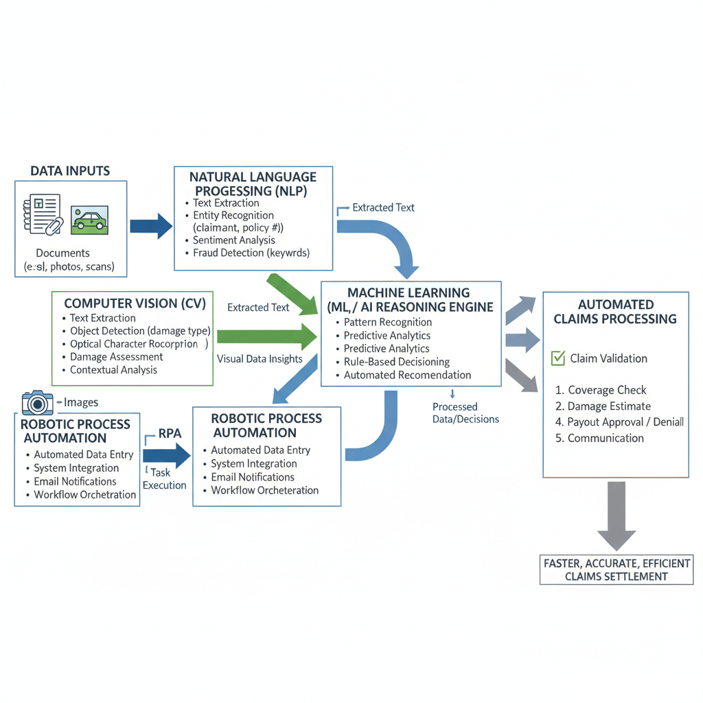
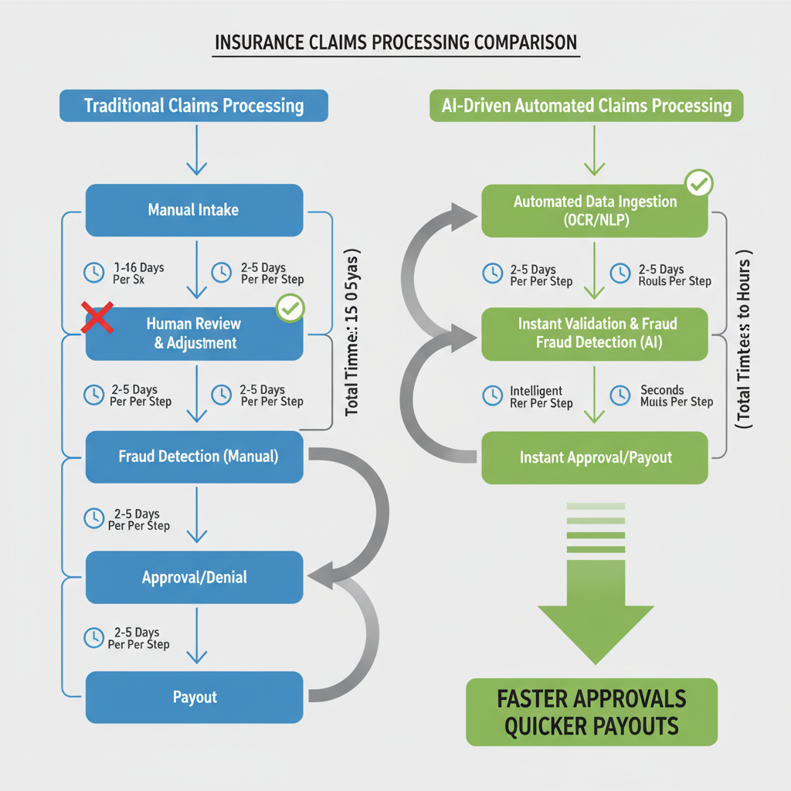
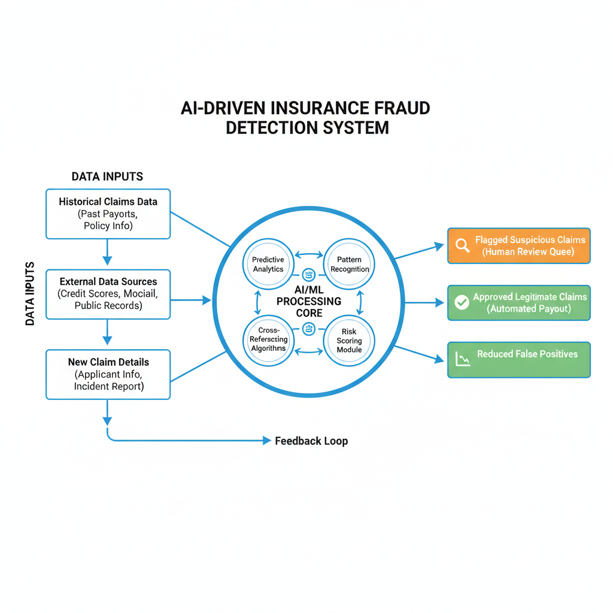

# AI-Driven Claims Automation: A Blueprint for Efficiency and Fraud Reduction (Using ICICI Lombard as an Industry Example)

## Introduction to AI in Insurance Claims

The insurance industry grapples with an immense volume and intricate complexity of claims daily, spanning diverse sectors from automotive and health to property and life. Each claim, irrespective of its nature, involves extensive documentation, verification processes, and adherence to specific policy terms and regulatory frameworks, often leading to a labyrinthine administrative burden. This inherent complexity directly contributes to two critical pain points: prolonged Turnaround Times (TAT) and persistent fraud. Slow claim processing erodes customer satisfaction and trust, while fraudulent claims inflict substantial financial losses, ultimately impacting profitability and driving up premiums for honest policyholders.

In response to these escalating challenges, Artificial Intelligence (AI) and Machine Learning (ML) have emerged as transformative technologies. These advanced systems offer unprecedented capabilities for automating routine tasks, analyzing vast datasets for patterns, and identifying anomalies with a precision previously unattainable. By leveraging AI and ML, insurers can significantly enhance operational efficiency, expedite claim settlements, and bolster fraud detection capabilities. ICICI Lombard, a prominent player in the Indian insurance landscape, stands as a compelling industry example of an organization actively navigating and harnessing these technological trends to redefine its claims management processes.

## The Bottlenecks of Traditional Claims Processing

Traditional insurance claims processing, while foundational, is inherently susceptible to a myriad of inefficiencies that impede both operational flow and customer satisfaction. At its core, the process relies heavily on manual data entry, document review, and verification. This labor-intensive approach is challenged by the sheer volume of incoming claims, diverse document formats, and the intricate details required for accurate processing, leading to significant administrative overhead.

This manual dependency inevitably introduces human error into the equation. Typos, misinterpretations, or overlooked details during data transcription or document assessment can lead to inconsistencies across records, necessitating costly rework and extended processing times. These errors not only inflate operational costs but also contribute to a cycle of delays that frustrates claimants and erodes trust in the insurer.

Furthermore, the lengthy timelines associated with traditional investigations and approvals significantly impact customer satisfaction. Each step—from initial assessment to detailed investigation, adjuster visits, and final approval—often involves sequential human touchpoints and physical document handling. This protracted back-and-forth communication and slow progression leave customers waiting, diminishing their experience during what is often an already stressful period.

Finally, the limitations of static, rule-based systems and human review become starkly evident when confronting sophisticated and evolving fraud patterns. While human diligence is valuable, it can be overwhelmed by volume, and traditional rules struggle to identify novel or complex schemes that cleverly skirt predefined parameters. This leaves insurers vulnerable to significant financial losses and highlights the urgent need for more adaptive and intelligent detection mechanisms.

## AI Technologies Powering Claims Automation

The transformation of claims processing hinges significantly on the strategic application of advanced AI and Machine Learning technologies. These tools are redefining efficiency, accuracy, and fraud detection capabilities within the insurance sector.

**Natural Language Processing (NLP)** stands at the forefront of automating document-heavy tasks. It empowers systems to intelligently analyze vast amounts of unstructured text from claim forms, medical reports, and policy documents. NLP algorithms automatically extract critical information—such as dates, parties, incident descriptions, and policy numbers—significantly reducing manual data entry. Furthermore, sentiment analysis capabilities allow insurers to gauge the tone and urgency of customer communications, enabling more empathetic and timely responses.

For visual evidence, **Computer Vision** plays a pivotal role. This technology enables automated analysis of images and videos submitted as part of a claim. It can accurately assess the extent of damage to vehicles or property, identify specific objects, and validate the authenticity and context of visual evidence. This accelerates damage assessment, reduces the need for physical inspections, and provides objective, consistent evaluations.

Underpinning much of the intelligence are **Machine Learning models**. These models are trained on historical claims data to perform sophisticated predictive analytics. They can forecast claim severity, assess the likelihood of fraud by identifying suspicious patterns, and calculate risk scores for individual claims. This proactive approach helps prioritize high-risk cases for human review and fast-track straightforward claims, optimizing resource allocation.

Finally, **Robotic Process Automation (RPA)** acts as an orchestrator, automating repetitive, rule-based tasks that often consume significant manual effort. RPA bots can seamlessly integrate with existing systems, performing actions like data entry, initiating payments, sending automated notifications, and triggering subsequent workflow steps based on AI-driven insights.

*Key AI Technologies Powering Claims Automation.*

## Accelerating Turnaround Time (TAT) with AI

Artificial intelligence is fundamentally reshaping the claims landscape, with one of its most immediate and impactful benefits being a dramatic reduction in Turnaround Time (TAT). The journey begins right at the initial claim intake. Traditionally a manual, paper-intensive process, AI-powered systems now automate the ingestion of various claim documents, from scanned forms and medical records to incident photos and repair estimates. Using advanced Optical Character Recognition (OCR) and Natural Language Processing (NLP), AI solutions efficiently extract critical data points, such as policy numbers, claimant details, damage descriptions, and dates, significantly reducing the manual effort and potential for human error inherent in data entry.

*Accelerating Claims Turnaround Time: Traditional vs. AI-Driven Workflow.*

Once data is ingested and extracted, AI performs instant claim validation and preliminary assessment. Leveraging predefined business rules, policy parameters, and vast historical claims data, AI algorithms can quickly identify inconsistencies, flag potential issues, and categorize claims based on complexity or typicality. This immediate analysis allows for rapid triage, often validating straightforward claims against policy terms within moments of submission.

Furthermore, AI excels at optimizing resource allocation through intelligent claim routing. Based on the preliminary assessment, the system can automatically direct claims to the most appropriate adjusters, specialists, or departments. Complex cases might be routed to senior experts, while simpler, validated claims can be fast-tracked for automated processing or assigned to general adjusters with lower workloads. This ensures that every claim receives attention from the right expertise without unnecessary delays. The culmination of these automated steps — from intake and data extraction to validation and smart routing — creates a streamlined workflow that accelerates approvals and ultimately leads to quicker payouts, significantly enhancing the policyholder experience and operational efficiency.

## AI's Role in Robust Fraud Detection

Detecting and preventing fraudulent claims is a critical challenge for the insurance industry, directly impacting profitability and customer trust. Artificial intelligence offers a transformative approach, moving beyond traditional rule-based systems to establish a more dynamic and effective defense. AI's capabilities are pivotal in fortifying an insurer's ability to identify and mitigate fraud with unprecedented precision.

*AI-Driven Fraud Detection Workflow.*

At its core, AI leverages **predictive analytics** to sift through vast volumes of claims data, uncovering patterns, anomalies, and correlations that human analysts or simpler systems might miss. This involves identifying unusual behavior, such as a sudden surge in claims of a specific type from a particular region, or subtle deviations in claim characteristics that are historically associated with fraudulent activity. By analyzing historical data, AI models learn to distinguish legitimate claims from those exhibiting suspicious traits, providing early warning signals.

Furthermore, AI excels at **cross-referencing capabilities**, enabling it to detect inconsistencies across multiple claims, policies, or even external data sources. For instance, it can flag instances where the same incident is reported under different policies, identify discrepancies between a claimant's stated information and public records, or link individuals involved in multiple suspicious claims. This holistic view helps expose organized fraud rings and serial fraudsters who attempt to exploit system vulnerabilities.

The application of **machine learning** is central to this process, as models are trained on both verified fraudulent and legitimate claims. These models then assign a fraud risk score to each new claim, quantifying its likelihood of being fraudulent. Claims exceeding a predefined threshold are automatically flagged and prioritized for human review, ensuring that investigators focus their valuable time on the most promising cases.

A significant advantage of AI-driven systems is their ability to **reduce false positives** compared to traditional, rigid rule-based systems. While older systems often flag legitimate claims due to their inability to adapt to nuanced situations, AI's adaptive learning and contextual understanding lead to fewer erroneous alerts. This improvement in accuracy dramatically enhances investigator efficiency, allowing them to concentrate on genuine threats and accelerate the processing of legitimate claims, ultimately benefiting both the insurer and honest policyholders.

## Beyond TAT and Fraud: Broader Benefits for Insurers and Customers

AI-driven claims automation, while primarily celebrated for reducing Turnaround Time (TAT) and mitigating fraud, delivers a much wider spectrum of advantages that redefine the insurance landscape for both providers and policyholders.

Firstly, customers experience significantly improved satisfaction and loyalty. The automation of claims processing leads to faster resolution, removing a major point of stress during challenging times. Coupled with enhanced transparency through real-time updates and consistent application of policy rules, AI builds greater trust and fosters enduring relationships with policyholders.

Internally, insurers realize substantial gains in operational efficiency and significant cost savings. By automating routine tasks and leveraging AI for initial assessments, manual labor is drastically reduced. Furthermore, AI's precision minimizes processing errors, preventing costly rework and disputes, thereby optimizing resource allocation across the board.

Beyond immediate operational improvements, AI unlocks deeper insights from claims data. The ability to analyze vast datasets quickly and accurately empowers insurers with invaluable intelligence for strategic initiatives. This includes informing the development of innovative new products, optimizing pricing models for competitive advantage, and refining risk modeling to ensure healthier portfolios.

Crucially, AI doesn't replace human expertise but rather empowers it. By offloading repetitive and straightforward claims to automated systems, human adjusters are freed to dedicate their skills to complex cases that require nuanced judgment, empathy, and direct customer interaction. This shift allows them to focus on strategic decision-making and delivering a superior, personalized service where it matters most.

## Implementing AI: Challenges and Best Practices

Implementing AI-driven solutions for claims automation, while promising, comes with a distinct set of practical considerations and potential hurdles. Addressing these proactively is critical for successful adoption and realizing the full benefits.

First and foremost, the **critical importance of high-quality data** cannot be overstated. AI models are only as good as the data they are trained on; inaccurate, incomplete, or inconsistent data can lead to biased predictions and flawed outcomes. Establishing robust data governance frameworks is essential to ensure data integrity, accessibility, and security across the enterprise. Alongside this, stringent adherence to data privacy compliance, including anonymization and consent management, is non-negotiable to protect sensitive customer information and meet regulatory requirements.

Integrating new AI solutions with **existing legacy systems** often presents significant technical challenges. Many insurance core platforms were not designed for real-time data exchange or modern API architectures. A strategic approach involves developing robust API layers and middleware to bridge these gaps, enabling seamless data flow between AI modules and core claims processing systems. This demands careful planning and a deep understanding of the existing IT landscape to ensure interoperability.

Furthermore, **ethical considerations** are paramount when deploying AI in sensitive domains like claims. AI models can inadvertently perpetuate or amplify existing biases present in historical data, potentially leading to unfair or discriminatory outcomes. Implementing Explainable AI (XAI) is therefore crucial, providing transparency into how models arrive at their decisions, which is vital for regulatory compliance, auditability, and building user confidence. Continuous auditing for bias and fairness is an ongoing responsibility.

A **phased implementation approach** is highly recommended to mitigate risks and ensure smooth adoption. Starting with pilot projects in specific, well-defined areas allows organizations to learn, iterate, and demonstrate tangible value before scaling. Following deployment, continuous monitoring of model performance against key metrics is essential. AI models are not static; they require ongoing refinement, retraining with new data, and recalibration to maintain accuracy and adapt to evolving conditions and fraud patterns.

Finally, successful AI adoption extends beyond technology to the human element. Organizations must **foster a culture of innovation** and commit to **upskilling the workforce**. This involves equipping employees with the knowledge and tools to interact with, interpret, and leverage AI-driven insights effectively. Rather than replacing human expertise, AI should augment it, freeing up employees from repetitive tasks to focus on complex problem-solving, customer service, and strategic initiatives, thereby maximizing the technology's potential.

## The Future Landscape: AI and the Evolving Insurance Industry

The integration of AI into insurance is not a static endpoint but a dynamic journey, continually reshaping the industry's future. Looking ahead, we can anticipate even more sophisticated applications that promise to redefine customer interaction, risk management, and operational efficiency.

Generative AI, for instance, is poised to revolutionize personalized communication. Imagine AI systems crafting bespoke policy explanations tailored to individual comprehension levels, generating proactive advice based on lifestyle changes, or resolving complex queries through intelligent chatbots that learn and adapt. This extends to automated content generation, from drafting policy amendments to creating engaging educational materials, freeing human experts for higher-value tasks.

Beyond reactive processing, advanced predictive models will increasingly enable proactive risk management. By analyzing vast datasets—including historical claims, environmental factors, and behavioral patterns—AI can identify emerging risks before they manifest as claims. This allows insurers to intervene with preventative measures, such as recommending smart home devices to mitigate property damage or offering personalized safety programs to reduce accident frequency, ultimately preventing losses before they occur.

The proliferation of IoT devices and telematics will further empower this transformation. Real-time data streams from connected homes, vehicles, and wearables will provide unprecedented insights, facilitating instant claims processing for minor incidents and enabling highly dynamic pricing models. Premiums could adapt in real-time based on driving behavior, home security status, or even health metrics, creating fairer, more personalized insurance products.

Ultimately, these advancements converge towards a more fully autonomous claims ecosystem. While human oversight will remain critical for ethical considerations, complex investigations, and empathetic customer engagement during unique circumstances, the bulk of routine claims processing, from first notification of loss to final payout, will be orchestrated by AI. This evolution promises not only unparalleled efficiency and fraud reduction but also a significantly enhanced, proactive, and personalized experience for policyholders.

## Conclusion: Embracing Intelligent Automation for a Competitive Edge

As we've explored, AI-driven claims automation fundamentally reshapes the insurance landscape by delivering a powerful dual advantage: significantly reduced Turnaround Time (TAT) and vastly enhanced fraud detection capabilities. For industry leaders like ICICI Lombard, this translates into operational efficiencies, substantial cost savings, and a bolstered reputation for reliability. For policyholders, it means faster, fairer settlements and a more trustworthy, seamless insurance experience.

In an increasingly competitive and data-rich environment, embracing AI is no longer merely an option but a strategic imperative. It empowers modern insurers to achieve unprecedented levels of efficiency, accuracy, and ultimately, superior customer satisfaction. To secure a lasting competitive edge and thrive amidst evolving market demands, the path forward is clear: intelligent automation must be at the core of every insurer's digital transformation journey.
