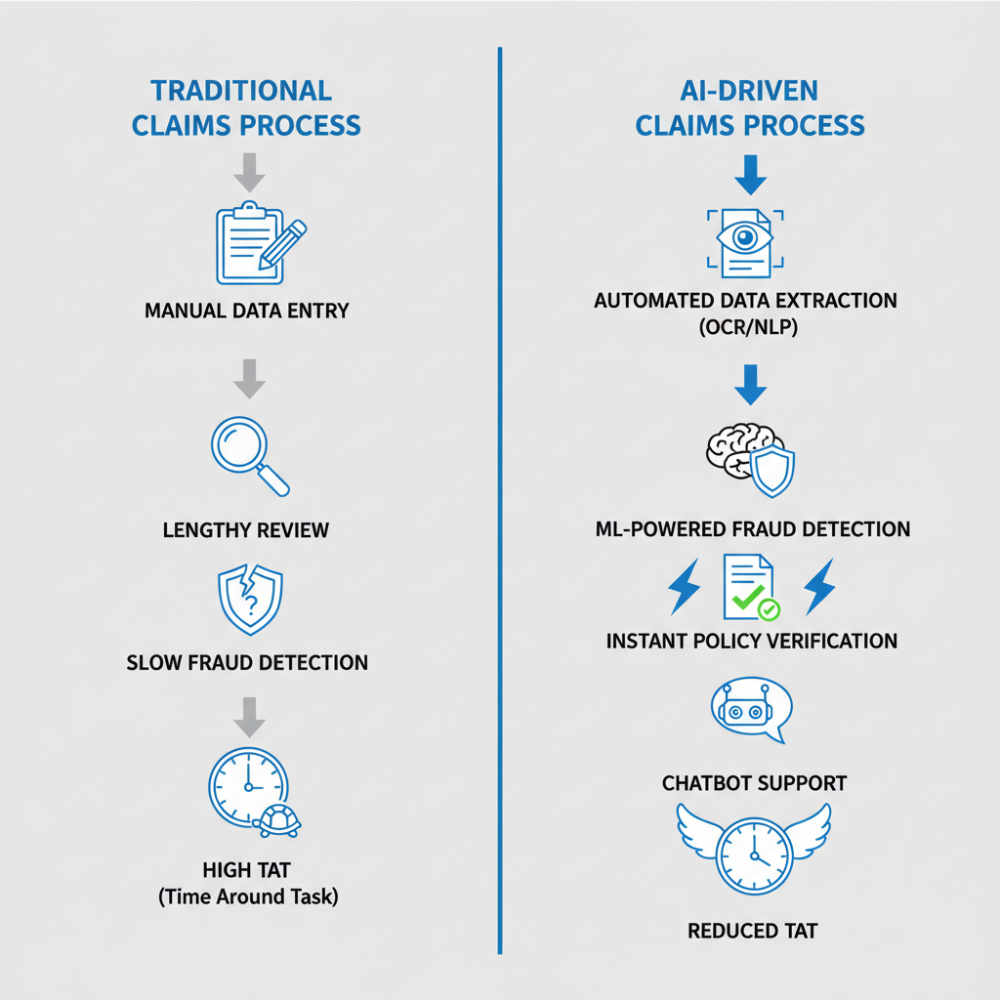
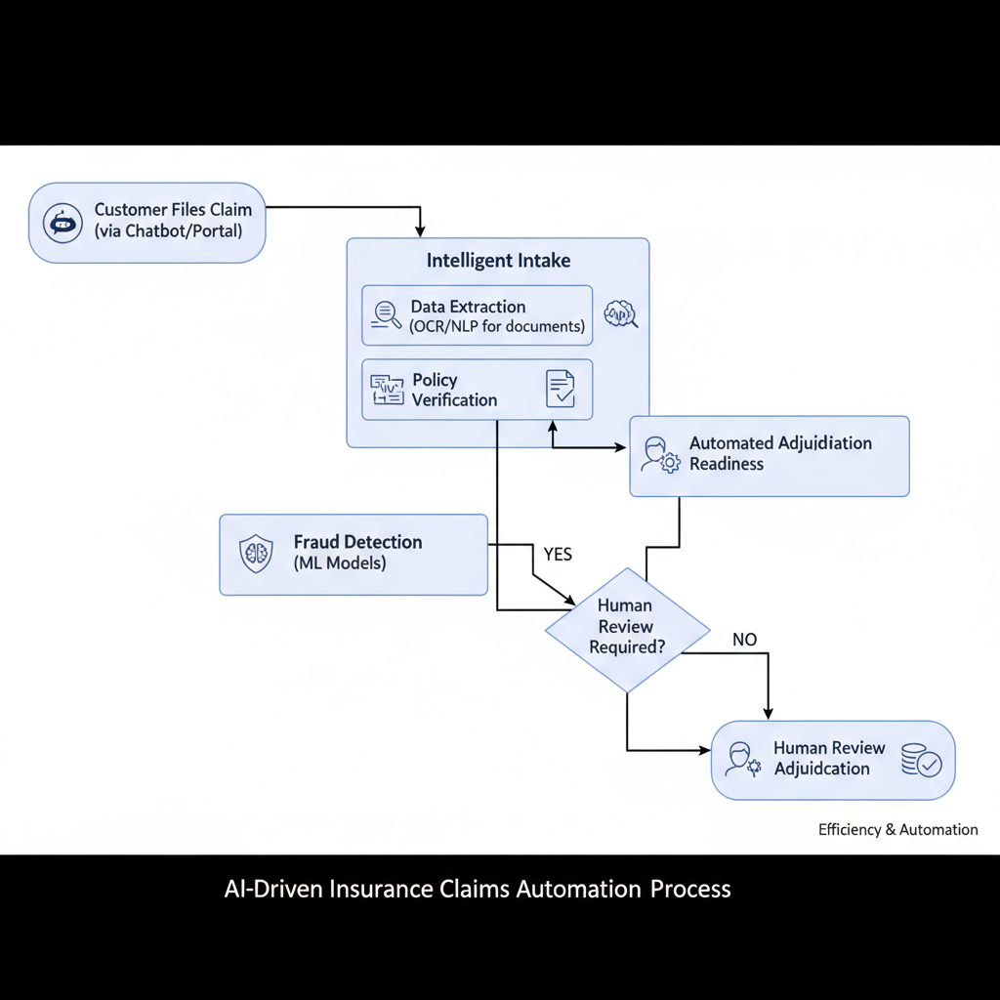

# AI-Driven Claims Automation at ICICI Lombard: Exploring Potential Amidst Awaiting News

## Introduction: The Transformative Promise of AI in Insurance Claims

Artificial intelligence (AI) is rapidly reshaping industries worldwide, with the insurance sector increasingly leveraging its capabilities for efficiency and innovation. Claims processing, in particular, is a critical area ripe for transformation. Historically, claims management has been plagued by lengthy Turnaround Times (TAT) and the persistent challenge of fraud detection, impacting both customer satisfaction and an insurer's bottom line.

AI offers compelling solutions to these pain points. By automating routine tasks and analyzing vast datasets, AI systems can significantly reduce processing times, accelerating payouts for legitimate claims. Concurrently, advanced machine learning algorithms enhance fraud detection capabilities, identifying suspicious activities with greater accuracy. This push towards digital transformation and AI adoption in claims management is a pervasive industry trend, driven by the demand for faster, more accurate, and cost-effective operations. Given its scale and market presence, a major player like ICICI Lombard is a prime candidate to explore and implement such advanced AI-driven innovations, aiming to redefine its claims experience.

*Traditional insurance claims processes often face challenges with lengthy turnaround times and manual fraud detection. AI-driven systems aim to significantly reduce TAT and enhance fraud detection through automation and advanced analytics.*
## ICICI Lombard's Strategic Position and AI Ambitions (General Context)

ICICI Lombard stands as a prominent private sector general insurance company in India, holding a significant market share and serving a diverse customer base across various insurance segments. The company has historically leveraged technology to enhance operational efficiency, streamline processes, and improve customer service. This proactive approach to digital transformation has been integral to its growth, focusing on robust IT infrastructure and digital platforms to manage its extensive operations without specific recent news regarding AI claims automation.

For an organization of ICICI Lombard's magnitude, managing a vast volume of claims efficiently is paramount. AI, particularly in claims automation, offers a strategic imperative to process these claims at scale, ensuring accuracy and speed while mitigating potential human errors and reducing turnaround times. Should they implement advanced AI solutions, the potential impact on customer experience — through faster settlements and transparent processes — and competitive advantage would be substantial, solidifying their position as an industry leader pushing the boundaries of InsurTech.

## How AI Tackles TAT and Fraud: A Deep Dive into Capabilities

AI's transformative potential in insurance claims processing reduces Turnaround Time (TAT) and enhances fraud detection. By automating and optimizing tasks, AI delivers faster, more accurate outcomes across the claims lifecycle.

*An AI-driven claims automation process streamlines operations from initial claim filing to settlement by integrating technologies like chatbots, OCR, NLP, and machine learning for fraud detection.*
Crucially, AI excels in **automating data extraction and validation**. Optical Character Recognition (OCR) accurately digitizes information from diverse claim documents, such as invoices or medical reports. Concurrently, Natural Language Processing (NLP) models understand context, identify key entities, and validate extracted data against predefined rules or existing policyholder information. This drastically minimizes manual data entry errors and significantly reduces initial processing time.

For robust **fraud detection**, machine learning (ML) models are indispensable. Analyzing vast datasets of historical claims, these models identify subtle patterns, anomalies, and correlations indicative of fraudulent activity. They flag suspicious claims based on factors like unusual frequency, inconsistent information, or deviations from typical claim profiles, presenting them to human adjusters for deeper investigation. This capability shifts the paradigm towards more proactive fraud prevention.

AI also accelerates upstream processes such as **policy verification and eligibility checks**. AI systems can instantaneously cross-reference submitted claim details with policy terms and conditions, automating the assessment of coverage and eligibility. This rapid verification streamlines approvals, ensuring valid claims are processed swiftly without unnecessary delays.

Lastly, **AI-driven chatbots and virtual assistants** streamline communication and initial claim filing. These intelligent agents guide policyholders through the preliminary claim submission process, answer frequently asked questions, and collect necessary information. Providing instant support, they enhance customer experience and speed up the claims journey while simultaneously reducing human workload.

## Challenges and Ethical Considerations in AI Claims Automation

While AI promises significant efficiencies in insurance claims, its deployment introduces distinct challenges and ethical considerations. A foundational concern is the absolute necessity of **high-quality, unbiased data** for training robust AI models. Flawed or unrepresentative datasets can lead to models that perpetuate existing biases or make inaccurate decisions, undermining trust in automated processes.

This directly ties into concerns about **algorithmic bias and ensuring fairness** in claims decisions. If historical claims data reflects past human biases, an AI model trained on it may inadvertently discriminate against certain demographics, leading to unfair outcomes. Mitigating such biases requires proactive data auditing and fairness metrics to ensure equitable treatment for all policyholders.

Furthermore, integrating AI into sensitive processes like claims necessitates strict **regulatory compliance and robust human oversight**. As AI regulations evolve, providers must ensure their systems adhere to frameworks regarding transparency, explainability, and accountability. Human experts remain crucial for reviewing complex claims, validating AI recommendations, and providing an ethical backstop, ensuring a "human-in-the-loop" approach.

Finally, handling sensitive customer information by AI systems raises significant **data privacy and security implications**. Insurance claims involve highly personal and financial data, making it paramount to implement stringent security protocols, encryption, and anonymization techniques. Adhering to data protection laws is not just a compliance requirement but a fundamental ethical obligation to maintain customer trust and prevent data breaches.

## The Current Information Landscape: No Recent News Found (As of 2026-02-01)

As a foundational principle for this "news roundup" blog post, transparency and evidence-based reporting are paramount. A thorough search for public announcements, press releases, or verifiable reports concerning ICICI Lombard's *recent* AI claims automation initiatives, specifically within the seven days preceding February 1, 2026, yielded no specific evidence. This means that as of our cutoff date, there are no new, publicly disclosed developments to report regarding their specific advancements in this domain.

Our commitment is to provide accurate and verified information, and we strictly avoid speculating or inventing events to fill an information gap. For a news roundup, the absence of specific, recent news is itself an important piece of information. The lack of public announcements could stem from various factors: internal development cycles, pilot programs that have not yet been publicized, a strategic focus on broader AI integration not yet detailed, or simply that no significant, newsworthy milestones have been reached within the very recent timeframe.

While the potential of AI in insurance claims automation, particularly for reducing turnaround times (TAT) and mitigating fraud, remains a highly relevant and exciting topic within the industry, current public information does not support a specific news item about ICICI Lombard's recent activities in this area. We continue to monitor developments closely and will report on verifiable news as it emerges.

## Future Outlook: What to Watch For in AI Claims Automation

As we look ahead, discerning the true impact and progress of AI in insurance claims automation requires vigilance. For companies like ICICI Lombard and other industry leaders, successful AI adoption will likely manifest through several key metrics. Keep an eye out for published improvements in Turnaround Time (TAT), quantifiable reductions in fraud rates, and enhanced customer satisfaction scores, often reflected in public surveys or Net Promoter Scores. These indicators will provide concrete evidence of AI's operational benefits.

To track these developments, readers should monitor public announcements diligently. Look for dedicated press releases detailing AI initiatives, mentions within annual reports or investor calls, and presentations at prominent industry conferences. Such disclosures offer valuable insights into strategic priorities and technological advancements.

Beyond individual company news, it's crucial to follow broader trends in InsurTech and AI innovation. Breakthroughs in machine learning, computer vision, and natural language processing will undoubtedly influence how insurers approach claims processing. The ongoing potential for AI to fundamentally reshape the insurance claims landscape—making it faster, fairer, and more efficient—remains significant and undeniable.