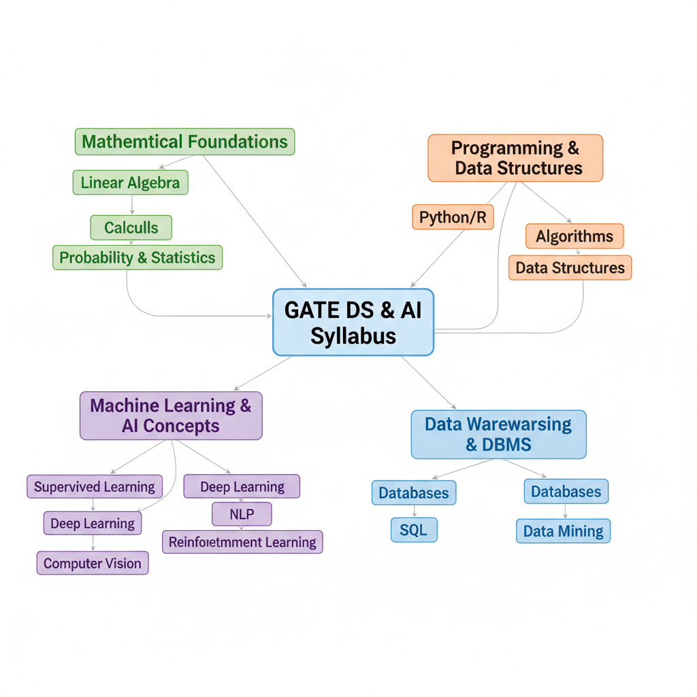
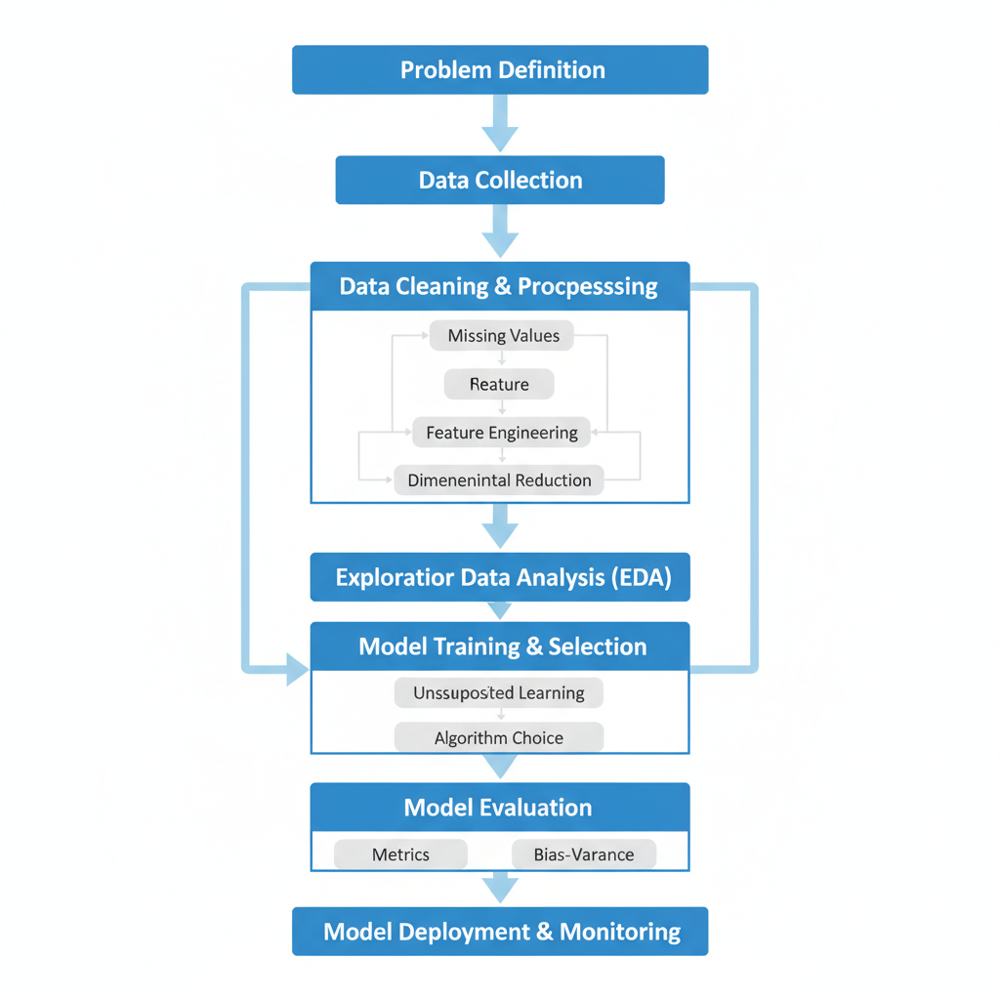
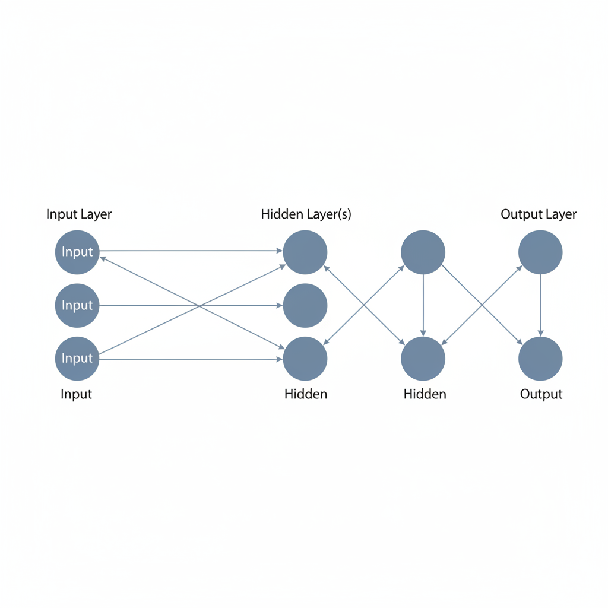

# Conquer GATE DS & AI 2026: Your Ultimate Preparation Blueprint

## Navigating the GATE DS & AI 2026 Landscape

The introduction of the Data Science & Artificial Intelligence (DA) paper in GATE reflects a strategic response to the escalating global demand for skilled professionals in these transformative fields. This new paper is significant, offering a specialized pathway for engineers to validate their expertise in cutting-edge domains like machine learning, data analytics, and artificial intelligence, thereby aligning academic pursuits with critical industry needs. It underscores the interdisciplinary nature and growing importance of AI and DS across various sectors.

The GATE DA 2026 examination typically comprises three main sections: General Aptitude, Engineering Mathematics, and the core Data Science & AI curriculum. Questions generally include Multiple Choice Questions (MCQ), Multiple Select Questions (MSQ), and Numerical Answer Type (NAT) questions, carrying both 1-mark and 2-mark weightage. Negative marking usually applies only to MCQs for incorrect answers. (Not found in provided sources.)

Based on typical GATE timelines, the application process for GATE 2026 would have opened around August/September of the preceding year, with the examination conducted in February. Aspiring candidates register online through the official GATE portal, submit required academic documents, and pay the examination fee within the stipulated deadlines. (Not found in provided sources.)

A strong performance in GATE DS & AI opens numerous doors for career and academic advancement. Academically, it serves as a gateway to prestigious M.Tech and Ph.D. programs in Data Science, AI, and Machine Learning at top-tier institutions like the IITs and IISc, fostering advanced research and specialization. Professionally, it significantly enhances employability for coveted roles such as Data Scientist, Machine Learning Engineer, and AI Specialist in both public sector undertakings (PSUs) and leading private companies, providing a competitive edge in a rapidly evolving job market.

## Decoding the Official GATE DS & AI 2026 Syllabus

To conquer GATE DS & AI 2026, your first strategic move is to thoroughly decode the official syllabus. It's not just a list of topics; it's your roadmap to understanding the examination's scope and depth. The syllabus is meticulously designed to assess both foundational knowledge and advanced application skills critical for a career in Data Science and Artificial Intelligence.

At its core, the syllabus firmly establishes **mathematical foundations**. Expect comprehensive coverage of Linear Algebra, crucial for understanding data transformations and algorithms; Calculus, underpinning optimization techniques in machine learning; and Probability and Statistics, essential for data analysis, modeling uncertainty, and hypothesis testing. A strong grasp here is non-negotiable for success.

Next, the syllabus delves into **programming concepts and data structures** highly relevant to DS & AI. This typically includes proficiency in a high-level programming language (often Python or R), alongside fundamental concepts like algorithms, complexity analysis, and various data structures such as arrays, linked lists, trees, and graphs. Practical application and efficient problem-solving are key here.

The heart of the examination lies in **essential Machine Learning and Artificial Intelligence concepts**. This broad area encompasses supervised and unsupervised learning, deep learning fundamentals, natural language processing basics, and computer vision concepts. Understanding the principles, algorithms, and limitations of various AI models is paramount.

Furthermore, the syllabus includes an **overview of Data Warehousing, Data Mining, and Database Management Systems (DBMS)**. This section ensures candidates understand how data is collected, stored, processed, and extracted for insights. Topics like relational databases, SQL, data warehousing architectures, and data mining techniques will be covered.

Finally, it's crucial to recognize the **interdisciplinary connections and potential overlaps** throughout the syllabus. For instance, statistical concepts are vital for machine learning model evaluation, and programming skills are indispensable for implementing any DS or AI algorithm. Understanding these linkages allows for a more holistic and efficient preparation strategy, reinforcing learning across different modules.

*An overview of the GATE DS & AI 2026 syllabus, highlighting key foundational and advanced topics.*

## Crafting Your Strategic Study Plan for GATE DS & AI Success

Conquering the GATE DS & AI 2026 examination demands more than just hard work; it requires a meticulously crafted and adaptable study strategy. Begin by implementing a **phase-wise study approach**: start with conceptual learning to build a strong foundation in core Data Science and AI principles. Follow this with rigorous practice, solving a wide array of problems to solidify understanding and develop problem-solving speed. Conclude with dedicated revision, reinforcing all learned topics and identifying areas needing further attention.

Next, prioritize topics intelligently. Analyze previous year's papers to understand subject weightage, then align this with your personal strengths and identified weaknesses. Allocate more time to high-weightage or challenging areas, ensuring a balanced preparation. Crucially, emphasize the importance of consistent daily study sessions. Even short, focused periods are more effective than sporadic marathon sessions. Integrate regular, structured breaks to prevent burnout and maintain optimal concentration.

To stay on track, set realistic milestones for yourself, breaking down the vast syllabus into manageable chunks. Establish a system for tracking your progress effectively, whether it's a simple checklist, a detailed spreadsheet, or performance analysis from mock tests. Finally, integrate powerful learning techniques like active recall and spaced repetition. Actively testing yourself (e.g., explaining concepts without notes, using flashcards) and revisiting topics at increasing intervals will significantly enhance memory retention and deeper understanding, making your preparation highly efficient.

## Mastering Data Science Concepts and Expected Question Types

Excelling in the GATE Data Science & AI (DA) 2026 examination demands a robust understanding of core Data Science principles, alongside the ability to identify and tackle common question patterns. Your preparation blueprint should start with a solid foundation in statistics and probability, which underpins much of the field. You must **grasp statistical inference, hypothesis testing, and various probability distributions**—these are not just theoretical concepts but practical tools for data interpretation and model validation. Expect questions that test your ability to apply these concepts to real-world scenarios, often involving interpreting p-values or confidence intervals.

Moving from theory to practice, a critical phase in any data science pipeline is data preparation. You must **understand data preprocessing, feature engineering, and dimensionality reduction techniques**. This includes handling missing values, encoding categorical data, scaling features, and techniques like Principal Component Analysis (PCA). GATE questions in this area often present raw datasets or scenarios and ask you to choose the most appropriate preprocessing step or explain its implications.

The heart of Data Science lies in its algorithms. Begin by thoroughly familiarizing yourself with **supervised learning algorithms**. This includes **Regression** models like Linear and Logistic Regression, and **Classification** algorithms such as Support Vector Machines (SVMs), Decision Trees, and K-Nearest Neighbors (K-NN). Focus on their underlying principles, assumptions, and when to apply each. Expect problem-solving questions where you might need to identify the best algorithm for a given task or interpret model outputs.

Next, delve into **unsupervised learning algorithms**. Key areas here are **Clustering** techniques like K-Means and Hierarchical Clustering, along with **Association Rule Mining**. Understand how these algorithms discover hidden patterns and structures in unlabeled data. Questions could involve interpreting cluster results or identifying strong association rules from transaction data.

Finally, a crucial aspect often tested is your ability to **evaluate model performance**. Learn to use appropriate metrics (e.g., accuracy, precision, recall, F1-score for classification; RMSE, R-squared for regression), understand the importance of cross-validation, and critically analyze the bias-variance trade-off. This ensures you can not only build models but also assess their effectiveness and generalize well to unseen data. Questions will frequently involve comparing model performances or diagnosing underfitting/overfitting.

*The typical stages of a Data Science project, from problem definition to model deployment.*

## Excelling in Artificial Intelligence Concepts and Expected Question Types

To conquer the GATE DS & AI 2026 examination, a robust understanding of Artificial Intelligence fundamentals is paramount. The AI section demands both conceptual clarity and an ability to apply these ideas to problem-solving. Here's a strategic approach to build proficiency and anticipate typical question patterns.

Begin by solidifying your understanding of **Neural Networks (NNs)**, the bedrock of modern AI. Focus on the core components: the perceptron as the fundamental processing unit, various activation functions (e.g., ReLU, Sigmoid, Tanh) and their roles in introducing non-linearity, and critically, the backpropagation algorithm. Grasp how backpropagation enables neural networks to learn by iteratively adjusting weights based on error gradients. Expected questions often involve defining these components, tracing the flow of information, or conceptualizing the steps of backpropagation.

Next, delve into **Deep Learning fundamentals**, extending your knowledge beyond simple NNs. Concentrate on Convolutional Neural Networks (CNNs) for processing grid-like data such as images. Understand the purpose of convolutional layers for feature extraction and pooling layers for dimensionality reduction and translational invariance. Simultaneously, explore Recurrent Neural Networks (RNNs) designed for sequential data like text or time series. Pay special attention to Long Short-Term Memory (LSTMs) and Gated Recurrent Units (GRUs), which address the vanishing gradient problem in standard RNNs. Expect questions on their architectural differences, appropriate use cases, and the conceptual function of their specialized gates.

Transition to **Natural Language Processing (NLP) basics**, a crucial application area of AI. Familiarize yourself with fundamental concepts such as tokenization (breaking text into meaningful units), various word embedding techniques (e.g., Word2Vec, GloVe) that represent words as dense vectors, and the core idea behind simple language models (e.g., N-gram models) for predicting the next word in a sequence. GATE questions might test your understanding of these preprocessing steps and the conceptual utility of embeddings.

Simultaneously, build your foundation in **Computer Vision essentials**. Understand how images are represented digitally (pixels, color channels) and the basics of image processing (e.g., filtering, edge detection). Gain conceptual clarity on object detection, a key task that involves both classifying objects within an image and localizing them with bounding boxes. Questions could involve image data structures or the high-level steps involved in common computer vision tasks.

Finally, explore the conceptual basics of **Reinforcement Learning (RL)**. Understand the core components: an agent interacting with an environment, states, actions, and rewards. Grasp how an agent learns an optimal policy through trial and error to maximize cumulative rewards. Specifically, familiarize yourself with the fundamental idea of Q-learning, where the agent learns to estimate the value of taking a particular action in a given state. Expect questions defining these RL terms and illustrating the basic learning loop.

By systematically covering these areas, focusing on underlying principles, and considering potential question formats, you'll be well-prepared to tackle the AI section of GATE DS & AI 2026.

*A simplified representation of a feedforward neural network's architecture.*

## Leveraging Resources and Conquering Mock Tests

To truly conquer GATE DA 2026, a strategic approach to resources and rigorous practice is paramount. Begin by curating your study materials. Essential textbooks covering core Data Science and AI concepts, algorithms, and mathematics are indispensable. Supplement these with high-quality online courses from platforms like NPTEL and other reputable MOOCs (e.g., Coursera, edX), which often provide structured learning paths and video lectures.

A critical component of your preparation involves diligently solving previous year's GATE papers. Focus not only on the DA branch but also extract relevant questions from Computer Science (CS) and Statistics (ST) papers, as these often overlap with the DA syllabus. This practice familiarizes you with the exam pattern, question types, and difficulty level.

Next, develop effective strategies for taking full-length mock tests. Simulate the actual exam environment by adhering to strict timed conditions, avoiding distractions, and using only allowed aids. Treat each mock test as a real examination to build stamina and mental resilience.

Crucially, the learning doesn't stop after the test. Thoroughly analyze your mock test results. Identify specific weak areas—be it a particular topic, concept, or type of question. Analyze not just incorrect answers but also questions where you spent too much time or guessed. This analysis is key to improving your time management and refining your approach for subsequent tests.

Finally, consider joining online forums or dedicated study groups. Collaborative learning can provide fresh perspectives, clarify doubts, and keep you motivated. Sharing insights and discussing challenging problems within a community can significantly enhance your understanding and problem-solving skills.

## Final Revision and Exam Day Excellence

As the GATE DS & AI 2026 exam approaches, shifting focus to strategic revision and mental preparedness is paramount. Begin by consolidating your knowledge into **concise revision notes, mind maps, and flashcards**. These active recall tools are invaluable for quickly revisiting core concepts, algorithms, and formulas across Data Science, AI, and supporting subjects.

In the final days, leverage **last-minute tips** for quick reinforcement. This isn't about learning new material, but rather a rapid scan of critical concepts and frequently tested formulas, ensuring they are fresh in your mind.

Crucially, **prioritize your physical and mental well-being**. Adequate sleep, balanced nutrition, regular breaks, and light exercise in the weeks leading up to the exam will significantly boost your cognitive function and stress resilience. Avoid burnout.

On exam day, **develop robust strategies for approaching the paper**. Allocate time wisely – don't dwell too long on challenging questions. Practice smart question selection, attempting your strengths first. Be mindful of negative marking and avoid common pitfalls like misreading questions or making careless calculation errors.

Finally, **cultivate mental preparedness**. Enter the exam hall calm, confident, and focused. If anxiety creeps in, take a few deep breaths. Trust your preparation and maintain a positive mindset throughout the examination to ensure optimal performance.
