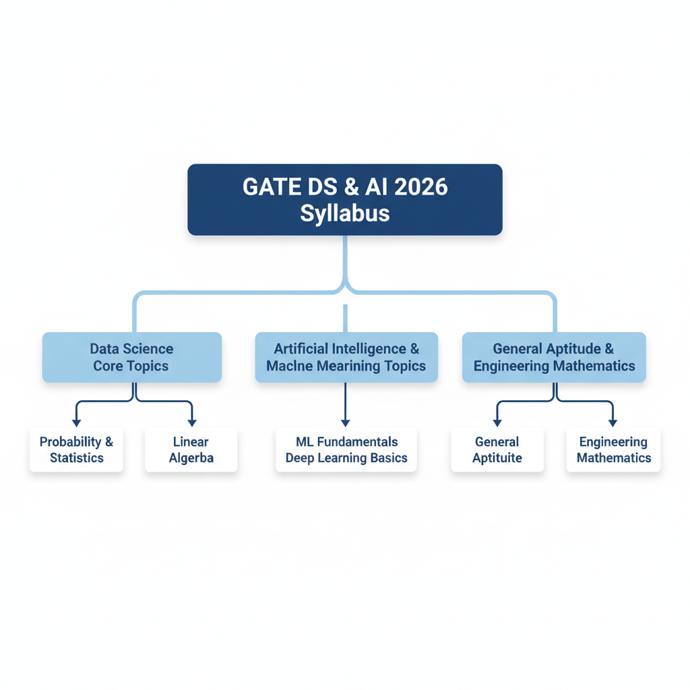
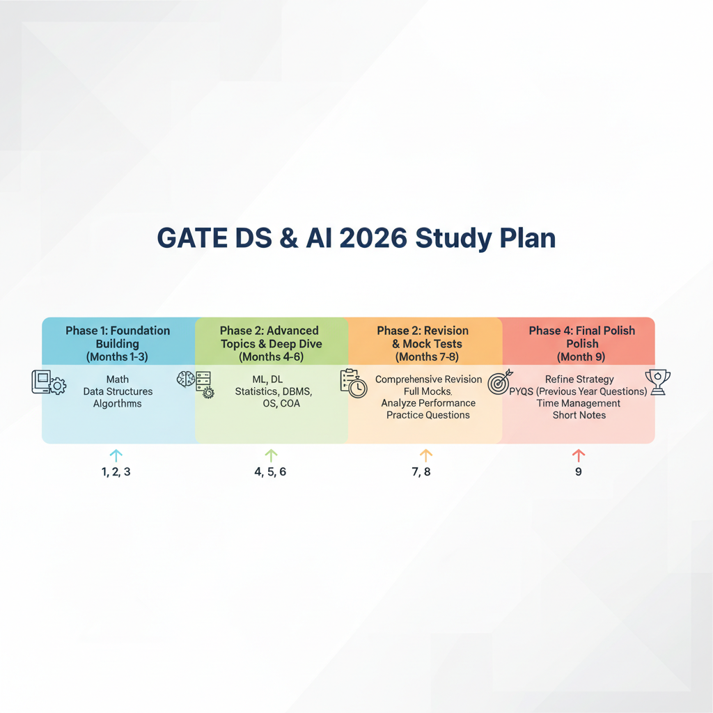
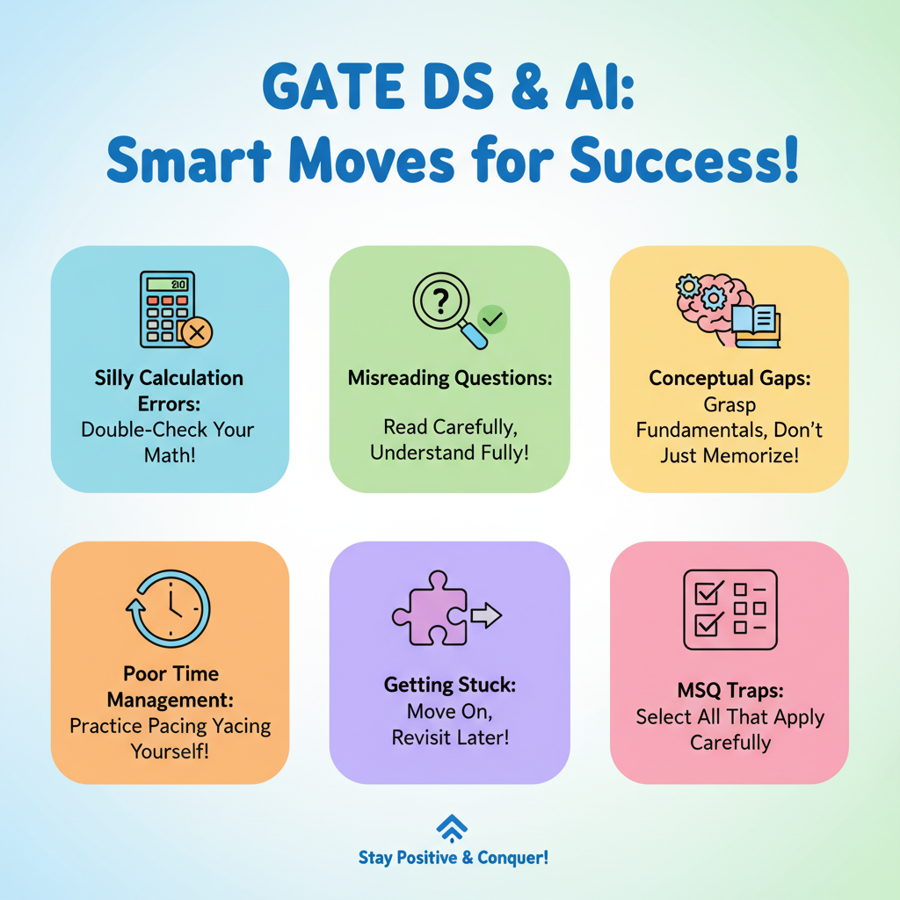

# Conquering GATE 2026 DS & AI: Your Ultimate Preparation Blueprint

## Understanding the GATE DS & AI 2026 Landscape

The GATE DS & AI paper was introduced to meet the surging demand for specialized talent in Data Science and Artificial Intelligence. It assesses candidates' comprehensive understanding of core DS and AI principles, algorithms, and applications, making it a crucial examination for aspiring professionals.

Globally and in India, the demand for DS & AI professionals is soaring. Industries across all sectors rapidly adopt AI-driven solutions and data-centric strategies, creating a significant need for skilled individuals to innovate and implement these cutting-edge technologies.

Excelling unlocks substantial opportunities. Academically, it offers admission to prestigious M.Tech, MS, and Ph.D. programs at top Indian institutions (IITs, IISc) in AI, ML, and DS. Professionally, qualified candidates are sought for roles like Data Scientist, ML Engineer, and AI Researcher in leading tech companies, startups, and Public Sector Undertakings (PSUs).

The GATE DS & AI exam is a 100-mark Computer-Based Test (CBT), featuring Multiple Choice Questions (MCQ), Multiple Select Questions (MSQ), and Numerical Answer Type (NAT) questions. MCQs typically carry negative marking. This rigorous format ensures a merit-based evaluation.

## Deep Dive into the GATE 2026 DS & AI Syllabus

A comprehensive understanding of the syllabus is the cornerstone of effective GATE preparation. While the precise, official GATE 2026 DS & AI syllabus details, including specific updates or exact weightage breakdowns, are not provided in the given context, we can outline the expected core components based on the general scope of such examinations. Aspiring candidates should always refer to the official GATE 2026 brochure for the most accurate and up-to-date information once released.

*Overview of the GATE DS & AI 2026 Syllabus Structure.*

### Data Science Core Topics

The foundational pillars of Data Science are critical for the DS & AI paper. Expect a thorough examination of:

*   **Probability and Statistics:** This includes random variables, various probability distributions (e.g., Binomial, Poisson, Normal, Exponential), Bayes' Theorem, descriptive statistics (mean, median, mode, variance, standard deviation), and inferential statistics (hypothesis testing, confidence intervals, ANOVA, correlation, and basic regression analysis).
*   **Linear Algebra:** Essential for understanding many machine learning algorithms, topics typically cover matrices and vectors, determinants, eigenvalues and eigenvectors, systems of linear equations, vector spaces, and matrix decompositions.
*   **Calculus:** Aspects of differential and integral calculus relevant to optimization and machine learning, such as limits, continuity, differentiation (including partial derivatives and gradients), and definite/indefinite integrals.

### Artificial Intelligence and Machine Learning Topics

This section forms the heart of the DS & AI paper, covering both theoretical understanding and practical applications:

*   **Machine Learning Fundamentals:** Supervised learning (linear and logistic regression, Support Vector Machines (SVMs), decision trees, ensemble methods like Random Forests and Gradient Boosting), Unsupervised learning (clustering algorithms like K-Means and hierarchical clustering), and dimensionality reduction techniques (e.g., Principal Component Analysis (PCA)).
*   **Deep Learning Basics:** An introduction to neural network architectures, including perceptrons, feedforward networks, activation functions, backpropagation algorithm, and fundamental concepts of Convolutional Neural Networks (CNNs) and Recurrent Neural Networks (RNNs).
*   **Artificial Intelligence Concepts:** Basic search algorithms (Breadth-First Search, Depth-First Search, A*), knowledge representation (first-order logic, propositional logic), and classical AI planning.

### General Aptitude and Engineering Mathematics

These sections are common across GATE papers and play a crucial role in overall scores:

*   **General Aptitude:** This component assesses verbal ability (grammar, vocabulary, reading comprehension), numerical ability (data interpretation, numerical computation, problem-solving), and logical reasoning (puzzles, critical reasoning, syllogisms).
*   **Engineering Mathematics:** Beyond the calculus and linear algebra aspects covered in Data Science core, this typically encompasses discrete mathematics (sets, relations, functions, graph theory, combinatorics, recurrence relations) and potentially further topics relevant to computational problem-solving.

### Potential Updates and Weightage Considerations

Regarding specific updates or changes to the GATE 2026 DS & AI syllabus compared to previous years, and precise weightage distribution for different sections, this information is not found in the provided sources. Candidates are strongly advised to refer to the official GATE 2026 information brochure and syllabus released by the organizing institute for the most accurate and up-to-date details. Historically, foundational topics in mathematics, statistics, and core machine learning concepts tend to form the bedrock of such examinations, suggesting their significant importance. Therefore, a strong grasp of these fundamentals is always a high-weightage area, regardless of minor syllabus adjustments.

## Crafting Your Strategic 9-Month Study Plan

A strategic 9-month study plan is your ultimate roadmap to conquering GATE 2026 DS & AI. Breaking down your preparation into distinct phases ensures comprehensive coverage and effective revision.

*Strategic 9-Month Study Plan for GATE DS & AI 2026.*

### Phase-Wise Approach
*   **Phase 1: Foundation Building (Months 1-3)**: Solidify core concepts: Mathematics (Linear Algebra, Probability, Calculus), General Aptitude, Data Structures, and Algorithms. Build a strong theoretical base and solve introductory problems.
*   **Phase 2: Advanced Topics & Deep Dive (Months 4-6)**: Transition to specialized DS & AI subjects: Machine Learning, Deep Learning, Statistics, and DBMS. Understand intricate algorithms, their applications, and problem-solving. Practice extensively with medium-difficulty questions.
*   **Phase 3: Revision & Mock Tests (Months 7-8)**: Comprehensive revision of all subjects, focusing on quick recall. Begin taking full-length mock tests regularly. Analyze performance to identify weak areas and improve speed/accuracy.
*   **Phase 4: Final Polish (Month 9)**: Refine your strategy. Revisit challenging topics, practice previous year's papers, and take final mock tests. Prioritize time management and cultivate a positive mindset.

### Daily and Weekly Study Schedule
A balanced, consistent schedule is paramount. Aim for 6-8 hours of dedicated study daily, split into focused sessions. Intersperse theoretical learning with practical problem-solving. For instance, dedicate 2 hours to theory, 2 hours to problems, and 1 hour to quick revision. Weekly, allocate half a day for reviewing the week's syllabus and practice questions. Consistency is key; regular short breaks are vital.

### Tackling Challenging Subjects & Maintaining Consistency
For difficult subjects, break them into smaller modules. Leverage multiple resources (textbooks, online lectures, diverse problem sets). Implement active recall and spaced repetition. Consistency is crucial; stick to your schedule diligently. Even short, daily sessions are more effective than infrequent marathons. Consider peer study groups and reward milestones to sustain motivation and prevent burnout.

### The Importance of Goal Setting
Your ultimate long-term goal is GATE 2026 DS & AI success. Break this down into actionable short-term goals: monthly targets (e.g., "Complete Syllabus X, 200 problems"), weekly objectives ("Master Topic A, 50 related problems"), and daily tasks ("Study Chapter 1, 10 numericals"). Regularly track progress. This allows for timely adjustments and provides a clear sense of accomplishment, reinforcing motivation.

## Essential Resources for GATE DS & AI Mastery

Effective preparation for GATE 2026 DS & AI hinges on leveraging the right resources. A strategic mix of foundational textbooks, comprehensive online courses, and rigorous practice materials will build a robust understanding of the syllabus and enhance your problem-solving skills.

To solidify your theoretical base, focus on core textbooks for each domain. For **Data Science**, consider foundational texts that cover data manipulation, analysis, and visualization. For **Machine Learning**, widely recognized books provide in-depth explanations of algorithms, their underlying mathematics, and applications. Essential **foundational mathematics** — linear algebra, calculus, probability, and statistics — are critical. Review standard university-level textbooks or dedicated GATE guides for these subjects.

Supplementing textbooks with online learning is highly effective. **NPTEL** offers a wealth of high-quality courses from IIT/IISc faculty, often directly aligning with the GATE syllabus. Look for courses on Data Science, Machine Learning, Deep Learning, and relevant mathematical foundations. Platforms like **Coursera** and **edX** also host excellent specializations and courses from top universities worldwide, providing structured learning paths and practical insights into algorithms and their applications.

For practice, **previous year's GATE papers (PYQs)** are your most valuable asset. Solve these diligently to understand the exam pattern, question types, and time management. Reputable **question banks** from established publishers or online platforms offer a vast collection of practice problems, often categorized by topic, helping you identify and strengthen weaker areas. Prioritize solving these questions under timed conditions to simulate the actual exam environment.

Beyond structured materials, utilize **free online resources and communities** wisely. The official GATE website is indispensable for the latest syllabus, notifications, and sample papers. YouTube channels offer conceptual clarity through video lectures and problem-solving sessions. Engaging with online forums and study groups (e.g., on Reddit or dedicated GATE preparation portals) can provide peer support, clarify doubts, and expose you to diverse problem-solving approaches. Remember to critically evaluate the information from unofficial sources.

## Mastering Practice and Mock Tests for Success

Solving previous year's GATE papers under timed conditions is fundamental to your preparation. This practice familiarizes you with the exam pattern, question types, and difficulty spectrum, while critically honing your time management skills. It solidifies concepts and reveals common pitfalls, preparing you for the actual three-hour challenge with a clear understanding of what to expect.

Full-length mock tests are essential simulations. Conduct them in a quiet, distraction-free environment, strictly adhering to the GATE exam's duration. These tests are invaluable for identifying your weak areas—be it specific topics, time management issues across sections, or strategic errors in question selection. They build stamina and acclimate you to the exam pressure, making the actual test day feel less daunting.

The real learning occurs post-mock test. Don't just check your score; meticulously analyze every question. For incorrect answers, pinpoint the root cause: conceptual misunderstanding, calculation error, or misinterpretation. For unattempted questions, determine if it was due to time constraints or lack of knowledge. Maintain an 'error log' to track recurring mistakes and ensure they become learning opportunities, not repeat failures.

Integrate mock tests progressively. Start with topic-wise quizzes and sectional tests. As you near the final 3-4 months, transition to full-length mocks, aiming for one per week. In the last month, increase frequency to bi-weekly. However, in the final few days, prioritize revision and confidence-building over taking new mocks to avoid burnout or last-minute anxiety.

## Demystifying Expected Questions & Trends for GATE 2026

Preparing for the GATE 2026 DS & AI exam requires more than just studying; it demands a strategic understanding of potential question patterns and emerging trends. By analyzing the landscape of Data Science and Artificial Intelligence, we can gain valuable insights into what to anticipate on exam day.

### Analyzing Past Papers & Core Themes

While the GATE DS & AI paper is relatively new compared to other disciplines, a review of previous iterations reveals a strong emphasis on foundational computer science principles alongside core DS & AI concepts. Expect recurring themes from:

*   **Algorithms & Data Structures:** Sorting, searching, graph algorithms (BFS, DFS, shortest path), dynamic programming, and data structures like trees, heaps, and hash tables remain critical. Understanding their complexity (time and space) is paramount.
*   **Discrete Mathematics & Probability:** Set theory, combinatorics, logic, and a solid grasp of probability distributions (Binomial, Poisson, Normal), conditional probability, and Bayes' Theorem are frequently tested.
*   **Linear Algebra & Calculus:** Fundamental concepts like matrix operations, eigenvalues, eigenvectors, gradients, and basic optimization are essential, especially for understanding machine learning algorithms.
*   **Machine Learning Fundamentals:** Supervised learning (linear/logistic regression, SVMs, decision trees, ensemble methods), unsupervised learning (clustering, dimensionality reduction), and basic deep learning architectures (MLPs, CNNs, RNNs) form the bedrock. Understanding their underlying principles, assumptions, and limitations is key.
*   **Statistics:** Hypothesis testing, correlation, regression analysis, and descriptive statistics are consistently featured.

### Emerging Topics to Watch For

The fields of Data Science and AI are rapidly evolving. For GATE 2026, it's prudent to consider how recent advancements might translate into exam questions. Potential areas likely to gain prominence include:

*   **Advanced Deep Learning Concepts:** Beyond basic architectures, questions might touch upon transformer networks (at a conceptual level), generative adversarial networks (GANs), or transfer learning.
*   **Reinforcement Learning Basics:** Understanding the core concepts of agents, environments, rewards, and basic algorithms like Q-learning could be beneficial.
*   **Responsible AI & Ethics:** As AI becomes more pervasive, conceptual questions on bias, fairness, interpretability, and ethical considerations in AI system design may appear.
*   **Big Data Technologies (Conceptual):** While deep implementation details are unlikely, a conceptual understanding of distributed systems like Hadoop or Spark for large-scale data processing might be tested.

### Common Question Types & Multi-Conceptual Problems

You'll encounter a mix of **conceptual** and **numerical** questions.
*   **Conceptual questions** often test your understanding of definitions, algorithm properties, assumptions of models, trade-offs (e.g., bias-variance), and the appropriate application of techniques.
*   **Numerical questions** will require calculations involving probability, statistics, matrix operations, algorithm complexity, or basic optimization.

**Multi-conceptual problems** are increasingly common, requiring you to integrate knowledge from different subjects. For instance, a problem might combine graph theory with dynamic programming, or a machine learning scenario might require statistical inference and algorithm analysis. To approach these:
1.  **Deconstruct:** Break the problem into smaller, identifiable sub-problems.
2.  **Identify Core Concepts:** Pinpoint the specific theories or algorithms each sub-problem relates to.
3.  **Visualize:** Use diagrams, flowcharts, or trace execution paths for clarity.
4.  **Connect the Dots:** Understand how the solutions to individual parts combine to address the overall problem. Consistent practice with such problems is vital.

### Avoiding Common Pitfalls

Students often lose marks in areas that can be easily addressed with careful preparation:

*Avoid These Common Pitfalls in GATE DS & AI.*

*   **Silly Calculation Errors:** Double-check arithmetic, especially in probability and linear algebra. Use a calculator judiciously.
*   **Misreading Questions:** Pay close attention to keywords like "NOT," "EXCEPT," "least," "most," and the specific requirements (e.g., "up to two decimal places").
*   **Conceptual Gaps:** Rote memorization without understanding the underlying principles is a common trap. Ensure you grasp *why* an algorithm works or *what* a statistical test implies.
*   **Time Management:** Don't get stuck on one difficult problem. If you're struggling, move on and revisit it later if time permits. Practice with timed mock tests to improve pacing.
*   **Multiple Select Questions (MSQs):** These are tricky. Ensure you identify *all* correct options and avoid marking incorrect ones. A single wrong selection can cost you marks.

By staying informed about these trends, practicing diligently, and focusing on both foundational and emerging topics, you can strategically prepare to conquer the GATE 2026 DS & AI exam.

## Last-Minute Revision & Exam Day Strategies

The final weeks before GATE 2026 are critical. For last-minute revision, focus on quick recall: review your concise notes, formula sheets, and concept summaries. Revisit previous year's questions and mock tests, emphasizing solution approaches. Dedicate short, focused sessions to your identified weak areas.

Managing stress is paramount. Practice mindfulness or breathing exercises, trust your preparation, and maintain a positive mindset. Adequate sleep in the days leading up to the exam is non-negotiable.

On exam day, effective time management is key. Scan the paper, tackle confident questions first, and don't get stuck on difficult problems. Intelligent question selection will maximize your score.

For a smooth experience, carry your admit card, a valid photo ID, two pens, and a transparent water bottle. Have a light breakfast and reach the center well in advance.

Avoid common mistakes: don't panic. Read every question carefully, paying attention to keywords. Resist overthinking simple problems and, crucially, avoid spending excessive time on any single question. Stay disciplined and focused.