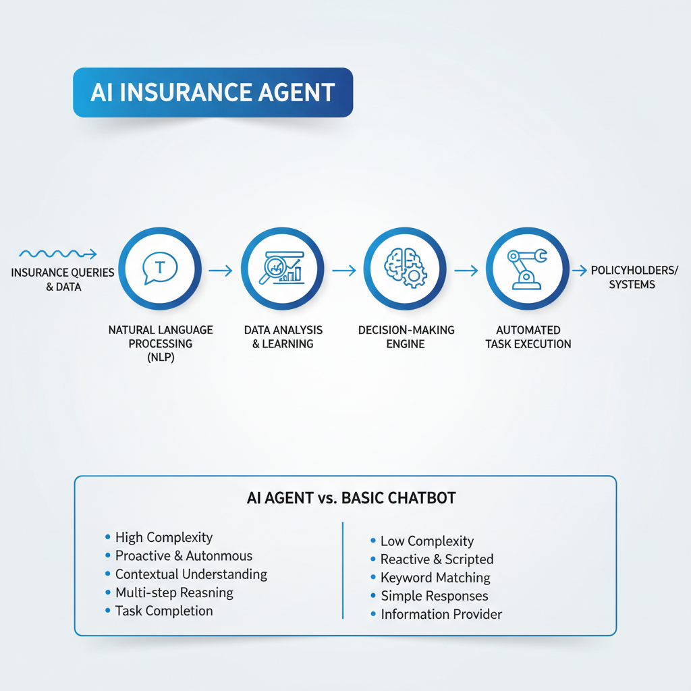
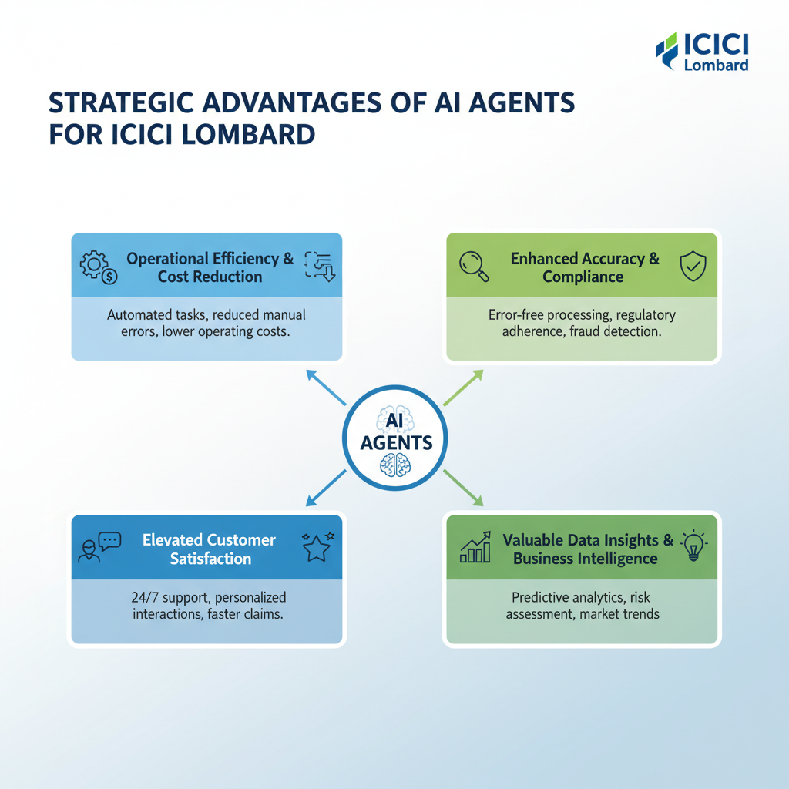

# From Claims to Customer Support: The Role of AI Agents at ICICI Lombard

## Introduction: The Rise of AI in Insurance

ICICI Lombard stands as a prominent general insurer in India, known for its extensive reach and diverse product offerings. The modern insurance landscape, however, is characterized by escalating complexities and an ever-increasing volume of operations. From managing intricate claim processes across various policy types to delivering consistently high-quality, personalized customer service at scale, insurers face significant operational hurdles. These challenges are compounded by evolving customer expectations for instant, seamless interactions and the continuous need for efficient fraud detection and policy administration.

In this dynamic environment, Artificial Intelligence (AI) agents are emerging as a pivotal, transformative solution. They offer the potential to streamline workflows, enhance decision-making capabilities, and significantly improve customer engagement. This blog post will delve into how ICICI Lombard is strategically deploying AI agents to navigate these complexities, exploring their impact across crucial areas such as claims processing, underwriting, and, crucially, customer support, ultimately redefining operational efficiency and service delivery.

## Demystifying AI Agents: What They Are and How They Work in Insurance

An **AI agent** is an autonomous, goal-oriented software entity designed to perceive, decide, and act to achieve specific objectives. Unlike traditional software following rigid rules, AI agents leverage advanced algorithms to learn, adapt, and operate with a degree of independence.

This sophistication differentiates them from basic chatbots. While chatbots handle conversational interfaces and FAQs, AI agents are engineered for complex, multi-step tasks. They analyze intricate data, make informed decisions, and manage workflows, often without direct human intervention. A chatbot assists simple queries; an AI agent manages entire processes.

Their core capabilities stem from key technologies: **Natural Language Processing (NLP)** for understanding human language; **data analysis** and **pattern recognition** for processing information, identifying trends, and deriving insights; and **automated task execution** for performing actions like updating records or initiating processes based on their analysis.

In insurance, these capabilities translate into powerful applications. An AI agent could process a claim by analyzing policy documents, incident reports, and historical data, flagging discrepancies or approving straightforward cases. They can personalize customer interactions, proactively offering services, or detect potential fraud by identifying unusual patterns. This intelligent automation redefines efficiency.

*AI agents leverage NLP, data analysis, and automated task execution for complex, multi-step processes, differentiating them from simpler chatbots.*

## AI in Claims Management: Streamlining the Journey at ICICI Lombard

The claims journey, traditionally a complex and often time-consuming process, is undergoing a profound transformation with the strategic integration of AI agents. For insurers like ICICI Lombard, leveraging these advanced technologies is key to enhancing operational efficiency, mitigating risks, and ultimately, delivering a superior policyholder experience. By automating and intelligentizing various stages, AI agents are redefining how claims are managed from inception to settlement.

*AI agents streamline the claims journey from FNOL to settlement, enhancing efficiency and accuracy at each stage.*

At the crucial **First Notice of Loss (FNOL)** stage, AI agents can significantly streamline initial data capture and assessment. Through natural language processing (NLP) and intelligent document processing (IDP), AI can automatically extract critical information from diverse channels—be it customer calls, web forms, or mobile app submissions. This includes details about the incident, policyholder information, and initial damage descriptions. AI can then perform an initial claim assessment, classifying the claim type and even flagging it for immediate human review if specific parameters (e.g., high severity, unusual circumstances) are met, thereby accelerating the initial processing phase.

Further into the claims lifecycle, **fraud detection and anomaly identification** become critical. AI-powered systems excel in analyzing vast datasets to identify patterns indicative of fraudulent activity or anomalies that deviate from typical claim behavior. By cross-referencing historical data, policy information, and external sources, these agents can flag suspicious claims for further investigation, helping to prevent financial losses and maintain the integrity of the claims process. This proactive approach to risk management is a significant advantage.

AI agents also play a pivotal role in accelerating **damage assessment, documentation verification, and claims adjudication**. Computer vision algorithms can analyze photos and videos of damage, providing initial estimates and verifying the extent of loss against policy terms. Concurrently, AI can rapidly review and verify supporting documentation, such as medical reports, police reports, and repair estimates, ensuring all necessary paperwork is in order. For simpler, low-value claims, AI can even perform automated adjudication, applying predefined rules and logic to approve and process claims without human intervention, drastically reducing processing times.

Ultimately, this comprehensive application of AI facilitates **more accurate and efficient claim settlements**. By minimizing manual errors, speeding up verification, and automating routine tasks, AI agents significantly reduce the overall turnaround time for claims. This translates directly into a faster, more transparent, and less stressful experience for policyholders, reinforcing trust and satisfaction. The strategic deployment of AI ensures that claims are handled not only with greater speed but also with consistent fairness and precision, aligning with the evolving demands of the modern insurance landscape.

## Enhancing Customer Support: The AI Agent Experience at ICICI Lombard

The landscape of customer interaction in the insurance sector is rapidly evolving, with AI agents playing a pivotal role in redefining service standards. For an industry leader like ICICI Lombard, integrating advanced AI capabilities into customer support is not just an efficiency play but a strategic move to deliver a superior policyholder experience.

One of the most immediate and impactful applications of AI at the front line of customer service is the deployment of **AI-powered chatbots and virtual assistants**. These intelligent agents are designed for instant query resolution, providing round-the-clock support without human intervention. Policyholders can quickly obtain essential information, such as policy details, answers to frequently asked questions (FAQs), and real-time status updates on claims or service requests (Not found in provided sources regarding specific deployment details for ICICI Lombard). This instant access significantly reduces wait times and empowers customers with self-service options, streamlining routine interactions.

Beyond mere information retrieval, AI enables a new level of **personalized communication and proactive outreach**. By analyzing policy details, claims history, and customer preferences (Not found in provided sources regarding specific data utilization by ICICI Lombard), AI agents can tailor interactions, offering relevant product information, reminding customers about upcoming renewals, or even proactively guiding them through complex processes. Imagine an AI agent notifying a customer about a potential coverage gap based on recent life events, or suggesting an optimal time for a policy review – this intelligent, anticipatory service transforms passive support into an active partnership.

Furthermore, AI agents excel at handling a vast volume of **routine and repetitive tasks**. Inquiries about address changes, premium payment schedules, or basic claim submission procedures can be fully automated. This strategic offloading frees human customer service representatives from monotonous work, allowing them to dedicate their expertise to more complex, sensitive, or emotionally charged customer issues. Human agents can then focus on situations requiring empathy, nuanced problem-solving, or intricate negotiations, elevating the overall quality of human-to-human interactions.

Finally, the inherent nature of AI agents provides significant benefits in terms of **24/7 availability and potential multilingual support**. Customers are no longer restricted by business hours, able to access assistance whenever and wherever they need it. Additionally, with advanced natural language processing, AI agents can be trained to communicate in multiple languages, ensuring inclusive support for a diverse customer base (Not found in provided sources regarding specific multilingual capabilities for ICICI Lombard). This continuous, accessible service significantly enhances customer satisfaction and loyalty, positioning ICICI Lombard at the forefront of digital customer experience.

## Strategic Advantages: Why ICICI Lombard Embraces AI Agents

ICICI Lombard's strategic embrace of AI agents across its operations is driven by a clear vision for transformative benefits, aiming to redefine efficiency, accuracy, and customer engagement within the insurance landscape. This move is not merely about technological adoption but about fundamentally enhancing core business functions.

*ICICI Lombard gains operational efficiency, accuracy, customer satisfaction, and valuable data insights by embracing AI agents.*

A primary advantage lies in **significant improvements in operational efficiency and potential cost reductions**. By automating repetitive, high-volume tasks such as initial claims triage, policy inquiry responses, and document verification, AI agents streamline workflows dramatically. This automation reduces manual processing times, frees human agents to focus on complex cases requiring empathy and nuanced judgment, and ultimately contributes to lower operational overheads and faster service delivery.

Furthermore, AI agents inherently **enhance accuracy, reduce human error, and improve compliance** across various insurance processes. Their ability to consistently apply rules, cross-reference vast datasets, and identify discrepancies minimizes mistakes in policy issuance, underwriting, and claims processing. This precision not only strengthens the integrity of operations but also ensures stricter adherence to evolving regulatory guidelines, mitigating risks associated with non-compliance.

Crucially, the adoption of AI agents is designed to **elevate customer satisfaction** through faster service, personalized interactions, and seamless experiences. AI-powered chatbots and virtual assistants provide instant, 24/7 support for routine queries, significantly reducing wait times. Moreover, by analyzing customer data, these agents can offer personalized product recommendations and proactive communications, creating more relevant and satisfying engagement points that build trust and loyalty.

Finally, AI agents serve as powerful engines for **valuable data insights, fueling business intelligence, product development, and predictive analytics**. Every interaction and transaction processed by an AI agent generates data that, when aggregated and analyzed, reveals critical trends in customer behavior, common pain points, and emerging market demands. This rich data empowers ICICI Lombard to develop more targeted products, optimize pricing strategies, refine risk assessment models, and make data-driven decisions that propel future growth and competitive advantage.

## Navigating the Future: Challenges and Ethical Considerations of AI in Insurance

While the transformative potential of AI agents in the insurance sector is undeniable, their deployment introduces a complex array of challenges and ethical considerations that demand careful navigation. Foremost among these is the critical concern of **data privacy and security**. Insurance, by its very nature, deals with vast quantities of sensitive personal, financial, and health information. AI systems, which thrive on data, must be designed and implemented with robust safeguards to prevent breaches, misuse, or unauthorized access. This necessitates state-of-the-art encryption, anonymization techniques, stringent access controls, and continuous auditing to ensure the responsible handling of customer data throughout its lifecycle.

Equally vital is the imperative for **transparency, explainability, and fairness** in AI decision-making processes, particularly in high-stakes areas like claims processing. The "black box" nature of some advanced AI models can obscure how decisions are reached, making it difficult for customers and regulators to understand or challenge outcomes. AI systems must be capable of providing clear, understandable reasons for their recommendations or denials. Furthermore, algorithms must be rigorously tested and monitored to eliminate inherent biases that could lead to discriminatory practices or unfair treatment of certain demographic groups, upholding the principles of equitable access and service.

The sophistication of AI agents also underscores the enduring need for **robust human oversight and a 'human-in-the-loop' approach**. While AI excels at processing data and identifying patterns, human judgment, empathy, and ethical reasoning remain irreplaceable. Complex or ambiguous cases, situations requiring nuanced understanding, or instances demanding compassionate interaction must always have a human point of escalation or final review. This ensures accountability for AI-driven outcomes and maintains the human connection vital for customer trust, allowing AI to augment, rather than replace, human expertise in critical junctures.

Finally, the rapid evolution of AI technology runs parallel to an **evolving regulatory landscape and compliance requirements** for financial services. Governments and regulatory bodies worldwide are actively developing frameworks to govern AI deployment, focusing on areas like data governance, algorithmic bias, accountability, and consumer protection. Insurance providers leveraging AI must proactively monitor and adapt to these emerging regulations, ensuring their AI strategies align with legal mandates and ethical guidelines. Proactive engagement with these standards will be crucial for maintaining trust and avoiding significant compliance hurdles in the future.

## The Road Ahead: Future of AI Agents at ICICI Lombard

As ICICI Lombard continues to pioneer digital transformation, the trajectory for AI agents points towards increasingly sophisticated and integrated roles. Looking ahead, these intelligent systems are poised to evolve beyond reactive support, embracing advanced capabilities that redefine insurance operations. We can speculate on their potential to leverage predictive analytics for proactive risk assessment, identifying emerging threats or high-risk profiles before incidents occur. This foresight could enable hyper-personalized policy recommendations, tailoring coverage dynamically to individual needs and changing circumstances.

Furthermore, the integration of AI agents is expected to extend across a broader spectrum of business functions. Beyond customer service and claims, we envision their deeper involvement in critical areas like underwriting, where AI could automate complex risk evaluations, streamline policy issuance, and detect potential fraud patterns with greater accuracy. In marketing, AI agents could power hyper-targeted campaigns and product development by continuously analyzing market trends and customer behavior, optimizing outreach efforts and ensuring relevance.

This continuous AI learning will be the bedrock for creating truly hyper-personalized insurance products and services. Imagine policies that adapt in real-time to a customer's lifestyle changes, location, or even driving habits, offering dynamic pricing and bespoke coverage on demand. The agents themselves would become the intuitive interface for these tailored offerings, providing seamless management and instant adjustments.

Underpinning this ambitious roadmap is an unwavering commitment to the continuous learning, adaptation, and ethical development of AI models. Ensuring fairness, transparency, and data privacy will remain paramount as these systems become more autonomous and influential. ICICI Lombard's vision is not just about deploying AI, but about fostering an intelligent ecosystem that grows responsibly, delivering unparalleled value and trust to its customers.

## Conclusion: A Smarter Tomorrow with AI Agents

Our exploration has revealed the profound impact of AI agents, revolutionizing operations at ICICI Lombard from the ground up. We've seen how these intelligent systems have transformed the often-complex landscape of claims processing, streamlining workflows and accelerating resolutions. Equally significant is their role in elevating customer support, providing instant, accurate, and personalized assistance that meets the modern policyholder's expectations for convenience and efficiency.

This dual benefit translates into a compelling value proposition: enhanced operational efficiency, reduced costs, and data-driven insights for ICICI Lombard, alongside a significantly improved, expedited, and more satisfactory experience for its policyholders. ICICI Lombard stands as a testament to pioneering digital transformation, leveraging AI to forge a more efficient, transparent, and inherently customer-centric future for insurance. The journey of AI in insurance is just beginning, promising a landscape where personalized, proactive, and seamless interactions become the norm, continually adapting to evolving customer needs and market dynamics.
