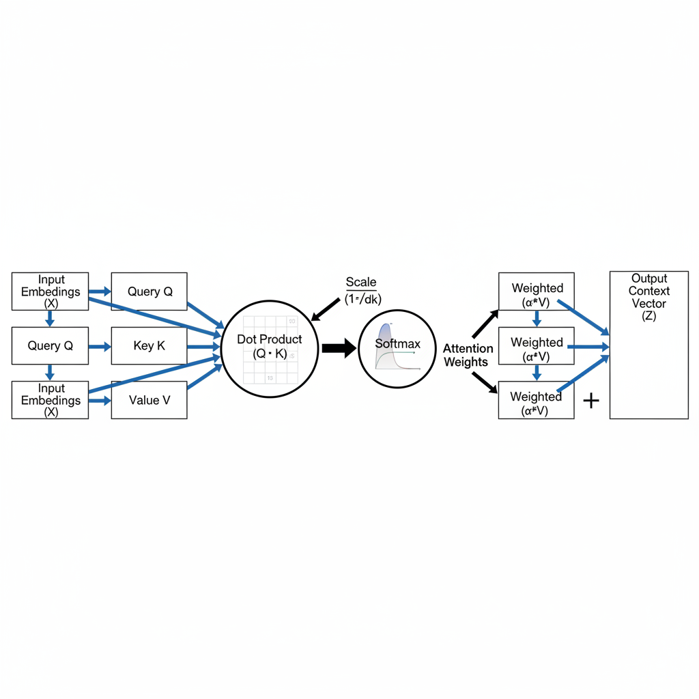
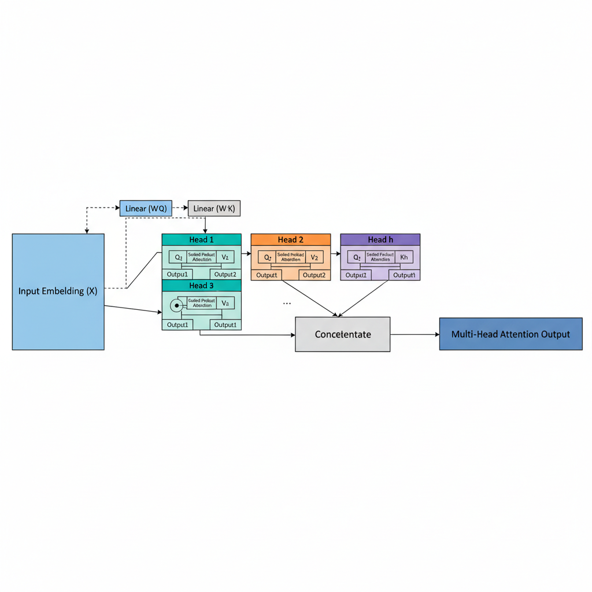
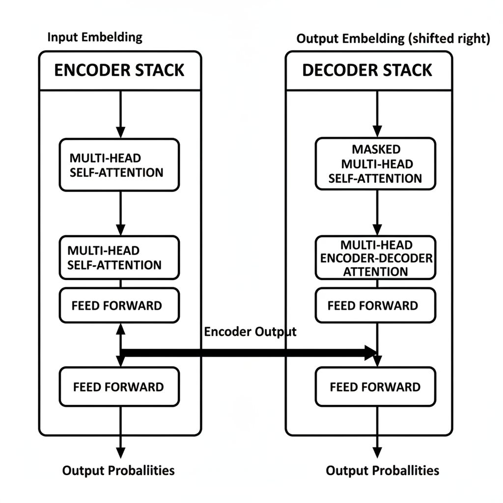

# Self-Attention Explained: The Core Mechanism Driving Modern AI

## Introduction to Self-Attention: Why It Matters

Self-attention is a pivotal mechanism in modern deep learning, designed to dynamically weigh the importance of different elements within an input sequence relative to each other. Rather than processing elements in isolation or a rigid linear order, self-attention computes a "contextualized" representation for each element by considering its relationship with every other element in the sequence. This inherent flexibility allows models to determine which parts of the input are most relevant for processing any given part.

This groundbreaking capability makes self-attention the foundational component of the revolutionary Transformer architecture. Transformers, introduced in 2017, largely superseded traditional recurrent neural networks (RNNs) like LSTMs and GRUs in many sequence modeling tasks. RNNs struggled with capturing long-range dependencies efficiently, as information could degrade or vanish over extended sequences. Self-attention, however, directly computes relationships between any two positions in the sequence, irrespective of their distance, thus effectively resolving this "long-range dependency problem."

This breakthrough has profoundly impacted advancements across numerous domains, most notably in Natural Language Processing (NLP). It is the core innovation enabling the success of powerful models like BERT, GPT, and T5. Beyond NLP, self-attention's principles are increasingly applied in computer vision, speech recognition, and even computational biology, solidifying its role as a critical innovation driving the current generation of AI capabilities.

## The Core Mechanism: How Self-Attention Works

At its core, self-attention empowers a model to dynamically weigh the importance of different elements within an input sequence when processing any single element. This crucial capability allows for a deep understanding of contextual relationships, far beyond what traditional recurrent or convolutional networks could achieve independently. The process unfolds in a series of logical steps, starting with the computation of 'attention scores' between all elements.

To calculate these scores, self-attention typically employs a **dot-product attention mechanism**. For each element in the sequence, three distinct vector representations are generated: a **Query (Q)**, a **Key (K)**, and a **Value (V)**. Conceptually, the Query vector represents "what I'm looking for," the Key vector represents "what I have to offer," and the Value vector holds the actual content to be aggregated. The similarity, or 'attention score', between any element's Query and every other element's Key (including its own) is computed by taking their dot product. A higher dot product signifies greater relevance between the two elements.

These raw attention scores are then passed through a **softmax function**. This normalization step converts the scores into **attention weights**, which are probabilities summing to one. These weights quantify the degree of focus or importance that each element should place on every other element in the sequence. For instance, if an element's Query strongly aligns with another element's Key, the softmax function will assign a higher attention weight to that pairing.

Finally, these normalized attention weights are used to create a new, **context-aware representation** for each element. This is achieved by taking a weighted sum of all the Value vectors in the sequence, where the weights are the attention weights calculated in the previous step. The resulting vector for each element is therefore an aggregate of the entire input sequence, enriched by information from the most relevant elements, as determined by the attention mechanism itself. This dynamic weighting allows the model to selectively focus on crucial parts of the input, enabling nuanced understanding and powerful contextual reasoning. 
*A detailed flow diagram of the core self-attention mechanism, illustrating the transformation of input embeddings into Query, Key, and Value vectors, their interaction to compute attention scores, normalization via softmax, and the final weighted sum to produce context-aware output vectors.*

## Query, Key, and Value: The Building Blocks of Attention

At the heart of the self-attention mechanism are three crucial vectors derived from each input token's embedding: the Query (Q), Key (K), and Value (V) vectors. For every input token in a sequence, its initial embedding is projected into these three distinct representations through learned linear transformations. These transformations allow the model to learn different aspects of the token's meaning relevant to its role in the attention calculation.

The interaction begins when a token's Query vector is used to "query" or compare itself against the Key vectors of all other tokens in the sequence (including itself). This comparison, typically a dot product, measures the similarity or relevance between the querying token and every other token. The higher the dot product, the more attention the querying token should pay to that specific key. These raw similarity scores are then usually normalized (e.g., using a softmax function) to produce attention weights, which sum to one.

Finally, these attention weights are applied to the Value vectors. Each weight dictates how much of a particular token's Value vector contributes to the output representation of the querying token. The weighted Value vectors are then summed up, producing a new, context-aware representation for the original querying token. Essentially, the Value vector holds the "content" or information that is passed along, modulated by the attention weights.

To make this intuitive, consider a search engine. Your search query is the **Query** vector. The search engine's index of all web pages, categorizing their content, acts as the collection of **Key** vectors. The search engine compares your Query against all Keys to find relevant pages. The actual content of those relevant web pages, which gets summarized and presented to you, represents the **Value** vectors. The more relevant a page (higher Q-K similarity), the more its content (Value) contributes to your final search results.

## Multi-Head Attention: Enhancing Focus and Representation

While the core self-attention mechanism effectively captures relationships within a sequence, a single "head" might be limited in its ability to simultaneously focus on diverse aspects of the input. For instance, in a sentence, one type of relationship might be grammatical dependencies, while another could be semantic similarities or even long-range contextual links. To address this, Multi-Head Attention scales the mechanism by allowing the model to attend to different parts of the information space concurrently.

The motivation is to enable the model to learn multiple, distinct sets of relationships in parallel. Each "head" within Multi-Head Attention operates with its own independent set of learnable Query, Key, and Value projection matrices. This allows each head to transform the input embeddings into a different representational subspace, effectively learning to focus on unique aspects or patterns within the input sequence. For example, one head might specialize in identifying subject-verb agreement, while another could focus on coreference resolution, and a third on the overall sentiment.

The process involves performing scaled dot-product attention in parallel across these multiple heads. The input sequence is first linearly projected `h` times (where `h` is the number of heads) to create `h` separate sets of Query, Key, and Value matrices. Each of these sets then undergoes the standard self-attention computation independently. This parallel computation significantly enhances the model's capacity to process and integrate diverse contextual information.

Finally, the output matrices from all `h` attention heads are concatenated along the feature dimension. This combined representation, rich with insights from various perspectives, is then passed through a final linear projection layer. This projection transforms the high-dimensional concatenated output back into the desired output dimension, typically the same as the input embedding dimension. This step allows the model to synthesize the distinct "views" of all heads into a unified, more robust representation, significantly boosting model performance and understanding. 
*An illustration of Multi-Head Attention, demonstrating how an input is split and processed by multiple independent attention heads in parallel, each learning different relationships, before their outputs are concatenated and linearly transformed.*

## Self-Attention in Action: The Transformer Architecture

The true impact of self-attention burst onto the scene with the seminal 2017 paper, "Attention Is All You Need." This groundbreaking work introduced the Transformer architecture, which rapidly became the dominant paradigm in natural language processing (NLP) and beyond. What made the Transformer revolutionary was its radical departure from previous state-of-the-art models: it relied *exclusively* on attention mechanisms, entirely eschewing recurrent neural networks (RNNs) and convolutional neural networks (CNNs) for sequence transduction tasks.

The original Transformer architecture features an encoder-decoder structure. The encoder, responsible for processing the input sequence, consists of multiple identical layers, each containing a multi-head self-attention sub-layer followed by a position-wise feed-forward network. Similarly, the decoder, which generates the output sequence, also has multiple identical layers. These decoder layers include a masked multi-head self-attention sub-layer (to prevent attending to future tokens), a multi-head attention sub-layer that attends to the encoder's output, and a position-wise feed-forward network. Self-attention is thus central to both encoding context and generating output.

This design choice, powered by self-attention, unlocked unprecedented capabilities. By allowing each token to instantly attend to all other tokens in the sequence, Transformers could process inputs in parallel, drastically reducing training times compared to sequential RNNs. Furthermore, self-attention's direct connections between distant tokens elegantly solved the long-range dependency problem that plagued RNNs, enabling effective handling of much longer sequences and capturing intricate relationships across vast textual spans. 
*A simplified block diagram of the Transformer architecture, highlighting the encoder and decoder components, and the placement of Multi-Head Self-Attention and Multi-Head Cross-Attention layers within them.*

## Impact and Applications: Where Self-Attention Shines

Self-attention has fundamentally reshaped modern AI, becoming an indispensable component across advanced applications. Its ability to weigh input sequence elements has led to unprecedented breakthroughs, particularly in natural language processing (NLP).

Prominent applications where self-attention truly shines include **Large Language Models (LLMs)**, which power conversational AI; sophisticated **machine translation** systems that bridge linguistic divides; and highly accurate **text summarization** tools. These systems leverage self-attention to process and understand vast amounts of textual data.

Influential models exemplify this impact. The **BERT** (Bidirectional Encoder Representations from Transformers) family revolutionized contextual understanding in NLP, while the **GPT series** delivered highly coherent text generation. Beyond NLP, self-attention's versatility led to **Vision Transformers (ViT)**, demonstrating its power in computer vision tasks.

Its core strength lies in effectively capturing **long-range dependencies** and intricate **complex contextual relationships** within data. Unlike previous architectures that struggled with distant information, self-attention allows models to simultaneously consider all elements in a sequence, regardless of their position. This global perspective is crucial for tasks like understanding the nuances of a long document or correlating visual features across an image.

Consequently, self-attention's influence has expanded significantly beyond its NLP origins. Its successful adoption in computer vision with models like ViT, and ongoing exploration in domains such as speech recognition and even drug discovery, underscores its status as a foundational mechanism for building robust and intelligent AI systems capable of deep understanding across diverse data types.

## Advantages and Remaining Challenges

Self-attention's widespread adoption stems from several key advantages. Foremost is its exceptional ability to model **long-range dependencies** within sequences. Unlike recurrent networks that process tokens sequentially or convolutional networks with fixed receptive fields, self-attention directly computes relationships between any two tokens, regardless of their distance. This global perspective is crucial for understanding context in complex data. Furthermore, its inherently **parallelizable** nature allows for highly efficient computation on modern hardware like GPUs, significantly speeding up training. Self-attention also offers a degree of **relative interpretability**; visualizing attention weights can sometimes reveal which input parts influenced a particular output token.

However, self-attention is not without its limitations. The most prominent challenge is its **quadratic computational and memory complexity** with respect to the sequence length (O(N^2)). As sequence length N grows, the computational cost and memory footprint required to store attention matrices increase rapidly, making it impractical for very long sequences common in domains like genomics or high-resolution media.

To mitigate these issues, active research explores more efficient alternatives. **Sparse attention** mechanisms reduce complexity by having each token attend to only a subset of others (e.g., local windows or learned patterns), while **linear attention** methods aim for O(N) complexity through approximations or kernel tricks. These approaches aim to maintain performance while dramatically improving scalability.

Ultimately, the choice to use self-attention involves a **trade-off**. While vanilla self-attention provides powerful, flexible, and often superior performance for many tasks, its resource demands necessitate careful consideration. For extremely long sequences or resource-constrained environments, researchers and practitioners must weigh the benefits of global context against the computational overhead, potentially opting for optimized variants or alternative architectures.