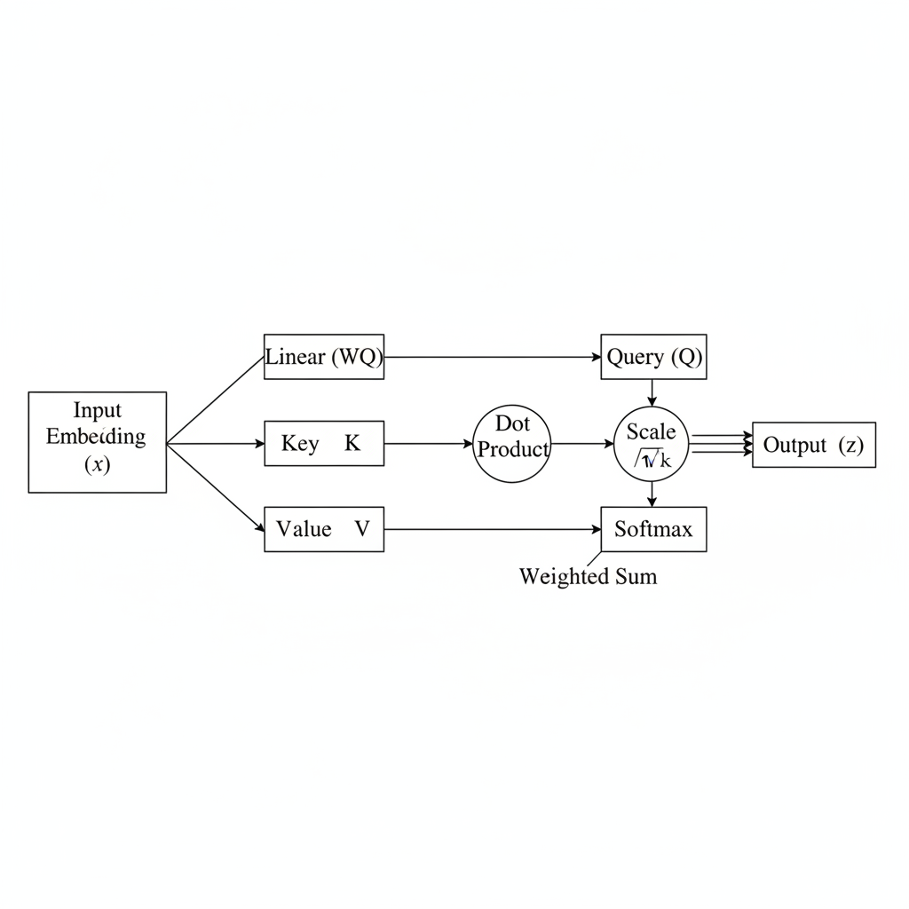

# Unpacking Self-Attention: The Core of Modern AI Models

## Introduction to Attention and Self-Attention

In the realm of neural networks, 'attention' is a powerful mechanism that enables a model to selectively focus on relevant parts of its input data when making predictions. Rather than processing all input uniformly, attention allows the network to assign varying degrees of importance to different input elements, mimicking human cognitive focus.

Historically, recurrent neural networks (RNNs) and their variants like Long Short-Term Memory (LSTMs) were dominant for sequential data. However, they faced significant challenges with "long-range dependencies," often struggling to capture relationships between distant elements in very long sequences due to their sequential processing and issues like vanishing gradients.

Self-attention emerged as an innovative solution to these limitations. Unlike traditional attention, which often focuses on an encoder's output for a decoder, self-attention allows each element within a single input sequence to weigh the importance of *every other* element in that *same* sequence. This intrinsic weighting helps the model understand contextual relationships irrespective of their positional distance. This breakthrough concept is the cornerstone of the Transformer architecture, which has revolutionized natural language processing, computer vision, and even reinforcement learning, becoming foundational for modern AI models.

## The Core Mechanism: Query, Key, and Value

At the heart of self-attention lies the ingenious Query, Key, and Value (QKV) mechanism. For every input token's embedding, three distinct vectors are derived by multiplying the embedding with separate learnable weight matrices: the Query (Q), Key (K), and Value (V) vectors. Conceptually, you can think of the Query as "what I'm looking for," the Key as "what I have to offer," and the Value as "the information I'll provide if I match."

*The core self-attention mechanism: Input embeddings are transformed into Query, Key, and Value vectors. Attention scores are computed from Query-Key similarities, scaled, and normalized by softmax. These scores then weight the Value vectors to produce a context-aware output.*

The first step in computing attention is to determine the relevance between different parts of the input sequence. This is achieved by calculating attention scores. For each Query vector, its similarity with *all* Key vectors in the input sequence is measured using a dot product. A higher dot product signifies greater similarity and, consequently, a stronger potential connection between the Query and that specific Key.

These raw attention scores are then processed further. To ensure stable gradients during training, especially with high-dimensional vectors, the scores are scaled down by dividing them by the square root of the Key vector's dimension ($\\sqrt{d_k}$). Following this, a softmax function is applied. This normalizes the scaled scores into a probability distribution, ensuring that all attention weights for a single Query sum to one. These normalized scores represent how much "attention" the current Query should pay to each part of the input.

Finally, these attention scores act as weights. Each normalized score is multiplied by its corresponding Value vector. The resulting weighted Value vectors are then summed together to produce the final output vector for that Query. This output is effectively a weighted average of all Value vectors, where the weighting highlights the information from the most relevant parts of the input sequence, as determined by the Query-Key similarities.

## Visualizing Self-Attention in Action

To intuitively grasp self-attention, let's consider a simple sentence: "The animal didn't cross the street because it was too wide." This sentence presents a classic ambiguity: what does "it" refer to? Is the animal too wide, or the street?

*When processing 'it' in the sentence, self-attention assigns higher weights to 'street,' indicating 'it' refers to the street, resolving ambiguity.*

Self-attention helps resolve this by allowing each word to 'attend' to every other word in the sequence, assigning varying relevance scores. When the model processes the word "it," it computes an attention score between "it" and every other word like "animal," "didn't," "cross," "street," "because," "was," "too," and "wide." For instance, if "it" refers to the "street," the attention mechanism would assign a significantly higher weight (or score) to "street" when forming the contextual representation for "it." Conversely, if "it" referred to the "animal," the weight for "animal" would be higher.

This mechanism is powerful because it inherently captures long-range dependencies and complex contextual relationships. Unlike traditional recurrent neural networks that process words sequentially, self-attention allows "it" to directly weigh the importance of "animal" or "street" regardless of their distance in the sentence. The output representation for "it" is not merely its original embedding but a rich, context-aware vector formed by a weighted sum of the values from all other words in the input sequence. This allows the model to build a deep understanding of the word's meaning within its specific context.

## Scaling Up: The Power of Multi-Head Attention

While the core self-attention mechanism is powerful, a single attention function might struggle to capture the full spectrum of relationships present in complex data. This is where **Multi-Head Attention** steps in, enhancing the model's ability to focus on different aspects of the input simultaneously. The core idea is to project the Query (Q), Key (K), and Value (V) matrices into multiple distinct sets, often referred to as 'heads' or subspaces. For each head, Q, K, and V are linearly transformed into lower-dimensional representations.

*Multi-Head Attention processes Q, K, and V through multiple parallel attention heads, each learning different relationships. Their outputs are concatenated and linearly projected to form a richer, aggregated representation.*

Once each head has computed its attention output, these individual outputs, which are typically lower-dimensional, are concatenated along the feature dimension. This combined, high-dimensional output is then passed through a final linear projection layer. This projection transforms the aggregated representation back into the desired output dimensionality, ensuring compatibility with subsequent layers in the model's architecture.

The benefits of multi-head attention are significant. By allowing the model to attend to information from different representation subspaces at different positions, it captures richer and more nuanced representations of the input data. This parallel processing of diverse "perspectives" greatly improves the model's capacity to learn complex patterns and relationships, making it a cornerstone of high-performing modern AI architectures like the Transformer.

## The Crucial Role of Positional Encoding

At its core, the self-attention mechanism is inherently permutation-invariant. This means that when processing a sequence of inputs, self-attention computes relationships between elements irrespective of their original order. It treats all elements as an unordered set, effectively lacking any inherent knowledge of their position within the sequence.

While this property allows for flexible parallel computation, it poses a significant challenge for tasks involving sequential data, such as natural language processing. The meaning of a sentence, for instance, is heavily dependent on word order ("dog bites man" versus "man bites dog"). Without positional information, self-attention cannot distinguish between such critical differences, leading to a loss of semantic understanding.

To overcome this limitation, positional encodings were introduced. These are specially designed vectors that carry information about the relative or absolute position of each element in the sequence. Common approaches include using fixed, deterministic functions, such as sinusoidal waves, or learned embeddings that are trained alongside the model.

Crucially, these positional encodings are *added* to the input embeddings before they enter the self-attention layers. This simple operation enriches each word's representation with its sequential context. While the self-attention mechanism itself remains permutation-invariant, it now operates on inputs that implicitly encode order, enabling the model to effectively understand the sequence's structure and the crucial role of word order in meaning.

## Self-Attention in Transformers and Beyond

The Transformer architecture, first introduced in "Attention Is All You Need," marked a pivotal shift in sequence modeling and is fundamentally built upon the self-attention mechanism. At its core, the Transformer employs an encoder-decoder structure. The encoder processes an input sequence, transforming it into a continuous representation, while the decoder generates an output sequence based on the encoder's output and previously generated tokens.

Within this architecture, self-attention layers are ubiquitous. Each encoder block contains a multi-head self-attention sub-layer, allowing it to weigh the importance of different words in the input sequence relative to each other, capturing long-range dependencies regardless of their distance. The decoder blocks are even more intricate, featuring two multi-head attention sub-layers: a masked multi-head self-attention layer, which prevents attending to future tokens during training, and an encoder-decoder attention layer, which helps the decoder focus on relevant parts of the encoder's output.

This powerful design has propelled self-attention to the forefront of modern AI. Prominent models like Google's BERT (Bidirectional Encoder Representations from Transformers) leverage the Transformer's encoder to achieve deep bidirectional understanding of language. OpenAI's GPT series (Generative Pre-trained Transformers), conversely, utilizes the Transformer's decoder to excel at generative tasks, producing coherent and contextually relevant text. Beyond natural language processing, self-attention has also made profound inroads into computer vision with models such as Vision Transformers (ViT), demonstrating its capability to process image patches as sequences, achieving state-of-the-art results comparable to or surpassing traditional convolutional neural networks in various tasks. The ability of self-attention to model global dependencies efficiently and effectively is truly what has enabled these groundbreaking advancements across diverse AI domains.

## Challenges and Future Directions for Self-Attention

While self-attention has revolutionized AI models, it's not without its limitations. A primary concern is its **quadratic computational complexity and memory requirements** with respect to the input sequence length. In standard self-attention, every token in a sequence must attend to every other token, resulting in an O(N^2) complexity for both computation and memory, where N is the sequence length. This arises from the need to compute and store an N x N attention matrix.

These quadratic scaling issues pose significant **implications for processing very long sequences**. For tasks involving entire documents, extended conversations, or high-resolution images/audio streams, where N can easily reach thousands or tens of thousands, standard self-attention quickly becomes computationally prohibitive. Models encounter excessive training times, demand immense GPU memory, and frequently hit out-of-memory errors, restricting their application to shorter contexts.

To overcome these hurdles, **ongoing research is actively exploring more efficient attention mechanisms**. Approaches like **sparse attention** reduce complexity by having each token attend only to a subset of relevant tokens (e.g., local windows, strided patterns, or learned sparse connections). **Linear attention** aims for O(N) complexity by reformulating the attention mechanism, often using kernel methods or associative memory, effectively avoiding the explicit computation of the N x N attention matrix. Furthermore, **recurrent attention** combines the strengths of attention with recurrent neural networks, allowing models to process sequences chunk by chunk while maintaining a compressed state, enabling the handling of extremely long contexts.

Beyond efficiency, other challenges include **interpretability**—understanding precisely *why* certain attention weights are learned and what they truly signify—and the potential for **biases** in these learned weights. Attention mechanisms can inadvertently amplify biases present in training data, leading to skewed decision-making or unfair representations. Addressing these multifaceted challenges remains a key focus for advancing the next generation of self-attention architectures.